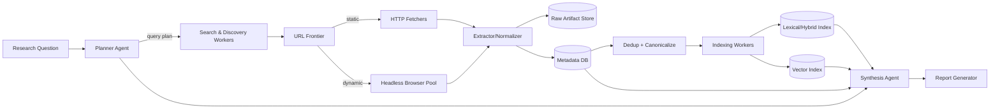
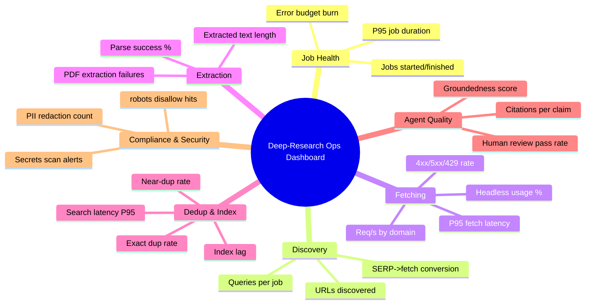

# Designing a Homemade Deep-Research Workflow with Free Search, Scraping, Headless Browsers, and Multi‑Agent Coordination

## Executive summary

A “deep-research” workflow is best treated as a **repeatable, auditable pipeline**: (1) plan queries, (2) discover candidate sources, (3) retrieve content reliably, (4) normalize + extract, (5) store + index with strong metadata, (6) deduplicate + tier sources, and (7) synthesize with traceable citations. This mirrors how modern crawlers, data pipelines, and retrieval systems are built—except optimized for *one-off research jobs* and *report-quality outputs* rather than continuous web indexing.

A practical homemade approach that scales from laptop to cluster is a **hybrid modular pipeline**: a single repo with well-separated services (or processes) connected by a queue, and a storage layer that preserves raw artifacts for replay. For orchestration, a distributed task queue (e.g., Celery) plus a relational metadata store (e.g., PostgreSQL) is usually the fastest path to a production-like system, while heavier workflow engines (e.g., Airflow, Temporal) become attractive once reliability, retries, and long-running jobs dominate. citeturn21search1turn2search0turn21search7turn14search1

The biggest design constraint is **legal/ethical and platform friction**: many sites actively block automation, and search engines often restrict automated access via terms and technical controls. For example, Google’s general Terms prohibit “bypassing… protective measures” and specifically call out automated access that violates machine-readable instructions such as robots.txt. citeturn7view0turn5search3 Separately, the Robots Exclusion Protocol (RFC 9309) explicitly states robots.txt is *not* an authorization mechanism, but it is a widely expected norm for responsible crawling. citeturn5search3 In the EU, scraping **personal data** typically triggers GDPR obligations (lawful basis, transparency, minimization, etc.), so privacy-by-design must be part of the architecture rather than an afterthought. citeturn19search2

A recommended starter stack (no specific budget/infra constraints) is:

- **Discovery:** combine “free/open” sources (Common Crawl) with at least one dependable SERP API (or self-hosted metasearch) for breadth. Common Crawl provides open WET/WARC data and index servers for querying captures. citeturn23search2turn23search5  
- **Fetching:** HTTP-first (Scrapy + HTTPX), with headless fallback (Playwright) for JS-heavy pages. citeturn21search0turn16search5turn22search12  
- **Extraction:** boilerplate-clean text extraction (Trafilatura), plus document parsing (Apache Tika / Unstructured) for PDFs/Office-like formats. citeturn16search2turn17search2turn17search3  
- **Orchestration:** Celery + Redis/Valkey-style broker, with strong rate-limiting and per-domain concurrency caps. citeturn21search1turn15search5  
- **Storage:** PostgreSQL for metadata + state, plus an object store (e.g., MinIO or filesystem) for raw HTML/PDF snapshots. citeturn2search0turn15search3  
- **Retrieval:** start with PostgreSQL full-text + pgvector (fastest “single-box” path), then graduate to OpenSearch/Vespa or a dedicated vector store if needed. citeturn10search2turn9search0turn9search7  
- **Agents:** use a graph-based coordinator for determinism (LangGraph) and/or a multi-agent framework (e.g., CrewAI / AutoGen) for specialized roles. citeturn13search6turn11search6turn3search3  
- **Quality + observability:** OpenTelemetry + Prometheus + Grafana for system metrics, plus an “LLM tracing/eval” layer if you use model-driven agents (Langfuse/Ragas/promptfoo). citeturn12search10turn12search3turn14search10turn20search0turn20search2turn20search3  

## System goals, win conditions, and success criteria

A homemade deep-research system should define **win conditions** that are measurable and can be tested with a regression suite (a set of “known-answer research tasks” and “hard web tasks” like JS-heavy pages, PDFs, and rate-limited domains). The table below offers concrete success criteria you can adopt or adapt.

### Win conditions

| Win condition | Short description | Metrics / KPIs (measurable) | Required components | Complexity | Common failure modes |
|---|---|---|---|---|---|
| Evidence coverage | Finds enough relevant sources across viewpoints and formats | (a) Unique domains per task, (b) % of tasks with ≥N Tier-0/1 sources, (c) median SERP→fetch conversion rate | Search, frontier, fetching, extraction, dedup, source-tiering | Medium | Over-reliance on one engine; paywalled/blocked pages reduce capture; brittle query planning |
| Citation-grounded synthesis | Outputs are traceable to retrieved sources | (a) Citations per claim ratio, (b) % claims with supporting snippet offsets, (c) human spot-check pass rate | Storage, metadata, chunking, report generator | Medium–High | Hallucinated or mismatched citations; lost provenance after dedup/chunking |
| Freshness control | Can answer “latest” questions with explicit recency | (a) Median source age, (b) % tasks where newest source is within X days, (c) crawl recency lag | Search, scheduling, incremental recrawl, caching | Medium | Stale indexes (e.g., archive data); missing Last-Modified; delayed recrawls |
| High-throughput acquisition | Efficiently collects content without blowing up cost/latency | (a) URLs/min, (b) P95 fetch latency, (c) headless % usage | Queue, rate limiting, static fetcher, headless pool | Medium–High | Headless bottlenecks; IP blocks; memory leaks in browsers; queue backlogs |
| Robust text extraction | Produces clean main text from diverse pages | (a) Parse success %, (b) avg extracted text length by content type, (c) boilerplate ratio | Extractors (HTML, PDF), normalization | Medium | JS-rendered pages missing content; broken HTML; PDF extraction quality variance |
| Low-duplication corpus | Avoids redundant pages and near-duplicates in index | (a) Exact dup rate, (b) near-dup rate, (c) index bloat factor | URL canonicalization, hashing, MinHash/SimHash, content fingerprinting | Medium | Canonical URLs ignored; parameter explosion; syndicated content overwhelms |
| Compliance-oriented crawling | Respects robots and avoids abusive patterns | (a) robots disallow violation count, (b) HTTP 429/403 rate, (c) complaints/takedowns | robots handling, rate limiting, audit logs, allow/deny lists | Medium | Misparsed robots; out-of-control concurrency; accidental scraping of restricted areas |
| Reproducible research jobs | Re-run a job later and get same trace (or explain differences) | (a) % jobs with full raw snapshot coverage, (b) deterministic pipeline hash, (c) replay success rate | Object store, metadata, versioning, workflow logs | Medium–High | Content drift; missing raw snapshots; non-deterministic agent planning |
| Operability & debugging | Failures are diagnosable quickly | (a) MTTR, (b) error budget burn, (c) % jobs with trace IDs and structured logs | Observability stack, tracing, alerting | Medium | “Black box” agents; no per-step spans; unstructured logs; no dashboards |

Key design implication: treat each “research job” as an **immutable artifact**: you should be able to answer “what did we fetch, when, from where, under what rules?” This is the foundation of both quality and compliance. citeturn12search10turn5search3

## Components and tool options

This section describes the major subsystems, the design trade-offs, and concrete tool choices. The goal is not “pick the fanciest tools,” but “pick tools that keep provenance intact, minimize brittleness, and are testable.”

### Core components you should design explicitly

**Search / discovery.** You need one or more “URL discovery” channels: SERP APIs, metasearch, site-specific search (sitemaps, RSS feeds), and/or web-scale datasets. Common Crawl provides a free open repository and indexes that can be queried to retrieve captures, which can partially substitute for SERP access in some domains. citeturn23search17turn23search5 Google’s Custom Search JSON API historically offered a small free quota but (per current docs) is not available for new customers and is planned for discontinuation in 2027—so it is not a stable long-term dependency to build around. citeturn4search2

**Scraping / fetching.** Use an HTTP crawler for most pages and reserve headless for dynamic content. Scrapy is a widely used crawling/scraping framework. citeturn21search0 For lower-level HTTP, HTTPX provides sync and async clients. citeturn16search5turn16search1

**Headless browser automation.** Modern websites often require JS rendering. Playwright supports Chromium/WebKit/Firefox and works headless or headed. citeturn22search0turn22search12 Selenium WebDriver drives browsers “natively” and implements the W3C WebDriver spec. citeturn22search1 Puppeteer controls browsers via DevTools Protocol or WebDriver BiDi and runs headless by default. citeturn22search2turn22search18

**Extraction & normalization.** Treat extraction as a separate stage. Trafilatura is designed for web text gathering and includes extraction of main text and metadata. citeturn16search2 For heterogeneous documents (PDF, PPT, etc.), Apache Tika detects and extracts metadata and text across many formats. citeturn17search2 Unstructured provides open-source components for ingestion and preprocessing of diverse formats including PDFs and HTML. citeturn17search3turn17search7

**Storage & indexing.** Store (a) raw snapshots for replay, (b) normalized text and structured metadata, (c) indexes optimized for retrieval. PostgreSQL is the common “system of record,” and extensions like pgvector enable vector similarity search alongside relational data. citeturn2search0turn10search2 For raw artifact storage, an S3-compatible object store like MinIO is a common open-source choice. citeturn15search3

**Source-tiering & metadata.** The system should assign every document: a tier, license/toxicity flags, extraction confidence, and provenance fields. Robots and per-site policies should be recorded at fetch-time; robots.txt is standardized in RFC 9309, and compliance should be treated as a first-class system feature. citeturn5search3 (Also note: robots.txt is not authorization, but many ToS and operational norms treat it as a key machine-readable signal. citeturn5search3turn7view0)

**Deduplication.** Use multiple layers: canonical URL normalization, exact hashing, and near-duplicate fingerprints. MinHash-style resemblance measures date back to classic work on document resemblance, and can be used to find near-duplicate pages efficiently. citeturn12search0 SimHash-style locality-sensitive hashing is also widely used for scalable similarity estimation. citeturn12search1

**Rate limiting & politeness.** Implement per-domain concurrency caps and token-bucket style rate limits; if you distribute fetchers, centralize limits in a shared store. Redis provides guidance on rate limiting patterns and primitives. citeturn15search5

**Agent coordination.** Treat agents as specialized components with explicit inputs/outputs. Graph-based orchestration is often easier to test than “free-form autonomy,” especially when you need reproducibility.

### Tool comparison tables

#### Search and URL discovery options (6–8)

| Option | Pros | Cons | Suitability |
|---|---|---|---|
| Google Custom Search JSON API citeturn4search2 | Official API path; structured results | Not available for new customers and planned for discontinuation (per current docs); limited free quota historically | Legacy systems or short-lived prototypes; not a stable new dependency |
| Brave Search API citeturn23search6turn23search0 | Independent index; structured API; monthly free credits via pricing model | Not “free at scale”; vendor dependency | Strong “starter SERP API” when you need reliable search results |
| Bing Search APIs on Azure citeturn23search1 | Official API; free tier options exist for some endpoints | Complexity of Azure setup; costs ramp with volume | Backup/alternative SERP channel; enterprise-friendly |
| Common Crawl Index + WARC/WET data citeturn23search5turn23search2turn23search17 | Free/open corpus; reproducible; good for broad crawl-based research | Not real-time; coverage bias; requires your own retrieval/ranking logic | Best for building “open web corpus” and reproducible pipelines |
| SearXNG (self-host metasearch) citeturn4search0 | Control + privacy; can query multiple engines | Depends on upstream engines’ rules; can break when engines change | Useful internal metasearch layer; best with conservative rate limits |
| `ddgs` / duckduckgo-search Python package citeturn4search1 | Very easy to prototype DDG-based discovery | Not an official search API; ToS/blocks risk | Prototype discovery; avoid as a critical production dependency |
| SerpAPI citeturn23search12 | Turnkey SERP extraction; handles infra complexity | Paid; can raise legal/ToS concerns depending on use | When you accept SaaS dependency to reduce engineering effort |
| DuckDuckGo “Instant Answers” sources approach citeturn6view1 | Useful for quick factual pointers | Not a general-purpose search results API | Supplemental only (not core discovery) |

#### Scraping, fetching, and text extraction options (6–8)

| Option | Pros | Cons | Suitability |
|---|---|---|---|
| Scrapy citeturn21search0 | Mature crawling framework; good for polite crawling + pipelines | Learning curve; asyncio integration can be non-trivial | Primary crawler/fetcher for static-ish sites |
| HTTPX citeturn16search5turn16search1 | Clean HTTP client; async support; good for high concurrency | You build crawling logic yourself | Lightweight fetchers and API calls; complements Scrapy |
| Beautiful Soup citeturn16search0 | Very approachable DOM parsing | Slower than optimized parsers; parsing quality depends on backend | Small-scale parsing, quick prototypes, or fallback parsing |
| Trafilatura citeturn16search2 | Main-text extraction + metadata; modular | Extraction quality varies by site type; tuning needed | Core “web page to clean text” stage |
| selectolax citeturn17search0 | Fast HTML parsing with CSS selectors | Smaller ecosystem than bs4/lxml | High-throughput HTML parsing / preprocessing |
| lxml citeturn17search1turn17search36 | Powerful HTML/XML parsing; XPath support; fast | API complexity; C deps | Structured extraction with XPath; scraper robustness |
| Apache Tika citeturn17search2 | Unified extraction for many file types; strong metadata | JVM service overhead | PDFs/Office docs ingestion at scale |
| Unstructured (open source) citeturn17search3turn17search7 | Document ingestion components across formats; LLM-focused pipelines | Dependency footprint; may require system deps | PDF/HTML/doc ingestion into chunkable elements |

#### Headless browser & dynamic rendering options (6)

| Option | Pros | Cons | Suitability |
|---|---|---|---|
| Playwright citeturn22search12turn22search0 | Cross-browser (Chromium/WebKit/Firefox); strong tooling; headless/CI support | Resource heavy at high scale | Default choice for JS-heavy pages and robust automation |
| Selenium WebDriver citeturn22search1turn22search5 | Standardized automation (W3C WebDriver); broad ecosystem | Can be slower/more brittle than newer tools | When you need compatibility with many browser setups |
| Puppeteer citeturn22search2turn22search18 | High-level DevTools control; headless by default | Primarily JS/Node-centric | When your scraping stack is Node-heavy |
| Chrome Headless mode citeturn22search3 | Official headless support; unattended environments | Still needs orchestration and anti-bot handling | Building your own headless pool with low-level control |
| Headless Chromium / `headless_shell` citeturn22search7 | Explicit headless binaries available via Chrome for Testing infra | Operational complexity; version pinning | High-scale headless pools and reproducible automation binaries |
| Crawlee “Playwright/Puppeteer crawler classes” citeturn16search35turn16search20 | Integrates crawling + headless + storage patterns | Opinionated; may encourage “stealth” patterns you should review ethically | Fast end-to-end scraper builds (use responsibly) |

#### Orchestration, queues, and distributed coordination (6–8)

| Option | Pros | Cons | Suitability |
|---|---|---|---|
| Celery citeturn21search1turn21search5 | Mature distributed task queue; retries, routing, monitoring concepts | Operational overhead (broker, workers); configuration complexity | Default “job runner” for fetch/extract/index tasks |
| RQ citeturn21search6turn21search2 | Simple Redis-backed job queue; low barrier | Less feature-rich than Celery | Smaller deployments; straightforward background work |
| Apache Airflow citeturn21search19turn21search7 | Strong scheduling, dependency graphs, operational UI | Heavier; best for batch workflows and ETL-style DAGs | Scheduled research runs, periodic recrawls, batch pipelines |
| Prefect citeturn1search3 | Developer-friendly orchestration; good for Python workflows | You must validate OSS vs cloud feature split | Mid-scale orchestration with Python-first ergonomics |
| Dagster citeturn14search3 | Data-aware orchestration; observability/lineage concepts | Still an “orchestrator platform,” not just a queue | Data/AI pipeline control plane with strong dev/test story |
| Temporal citeturn14search1turn14search20 | Durable execution; strong retries and crash-proof workflows | Steeper conceptual/operational learning | Long-running research jobs, human-in-the-loop, strong reliability needs |
| entity["organization","Apache Software Foundation","nonprofit open source org"] Kafka citeturn14search5 | Event streaming backbone; decouples services at scale | Operational complexity; not a “workflow engine” by itself | Event-driven architectures and high-throughput pipelines |
| Kubernetes Jobs/CronJobs citeturn15search0turn15search4 | Simple batch execution; built-in retry/backoff | Requires Kubernetes; debugging can be harder | Cluster-scale headless workers, scheduled recrawls |

#### Storage systems (raw artifacts, metadata, and state) (6–8)

| Option | Pros | Cons | Suitability |
|---|---|---|---|
| PostgreSQL citeturn2search0 | Strong consistency; rich indexing; good system-of-record | Ops overhead at scale; schema design matters | Metadata DB, job state, provenance, audit logs |
| SQLite citeturn2search1 | Zero-ops local DB; great for MVP | Concurrency constraints; not for multi-worker write-heavy workloads | MVP, single-machine prototype |
| entity["company","MongoDB","document db vendor"] (document DB) citeturn18search7 | Flexible schema; document-centric | Different operational model than relational; can encourage “schemaless sprawl” | Storing extracted JSON, page models, semi-structured artifacts |
| DuckDB citeturn18search1turn18search8 | In-process analytics; great for local analysis | Not a multi-writer OLTP database | Offline analysis, evaluation datasets, local experimentation |
| ClickHouse citeturn18search15turn18search36 | Columnar OLAP; excellent for logs/metrics-like analytics | Operational complexity; schema and ingestion planning | Large-scale crawl analytics (throughput, errors, corpus stats) |
| MinIO (object storage) citeturn15search3 | S3-compatible object store; good for raw HTML/PDF snapshots | License considerations; needs ops | Raw artifact store, replay, compliance archival |
| entity["company","Neo4j","graph database vendor"] citeturn18search13 | Graph model for entity/source relationships | Different query/modeling; may be overkill | Relationship-heavy provenance graphs, entity linking |

#### Indexing and retrieval (lexical / hybrid / vector) (6–8)

| Option | Pros | Cons | Suitability |
|---|---|---|---|
| OpenSearch citeturn9search0turn9search4 | Open-source search/analytics; vector search supported | Cluster ops overhead | Full-text + hybrid retrieval at scale |
| Elasticsearch citeturn2search2 | Mature ecosystem; strong relevance tooling | Licensing and distribution considerations | When you accept ecosystem constraints for features |
| Vespa citeturn9search7turn9search3 | Unified structured + lexical + vector search; powerful ranking | Steeper learning curve | High-end retrieval + ranking pipelines |
| Meilisearch citeturn9search1turn9search13 | Simple full-text; fast; community edition OSS | Fewer advanced IR knobs than Elasticsearch/Vespa | MVP→mid-scale search UI + retrieval |
| Milvus citeturn2search3 | Vector DB focus; scalable | Separate system; operational overhead | Dedicated vector retrieval at scale |
| Qdrant citeturn10search0turn10search4 | Vector search with payload filtering; Rust performance focus | Vector-only; you still need lexical search elsewhere | Vector retrieval with rich metadata filters |
| Weaviate citeturn10search1turn10search9 | Vector DB with object+vector model; hybrid patterns | System complexity; module choices | Semantic + filtered retrieval for “research memory” |
| pgvector on PostgreSQL citeturn10search2 | Keeps vectors with relational metadata; simpler ops | Not as specialized as dedicated vector DBs | Best “starter” vector retrieval with minimal infra |

#### Agent frameworks and coordination layers (6–8)

| Option | Pros | Cons | Suitability |
|---|---|---|---|
| LangChain citeturn3search0 | Popular integrations; tool calling and retrieval patterns | Can become complex; must enforce determinism yourself | Rapid prototyping of agentic retrieval + synthesis |
| LangGraph citeturn13search6turn13search10 | Graph-based agent workflows; durable execution concepts | Requires explicit graph design | Reliable multi-step research and controllable agent routing |
| Haystack citeturn3search1 | Retrieval pipelines; strong RAG primitives | Integration surface area | Search/retrieval-centric research systems |
| LlamaIndex citeturn3search2 | Data→index→query abstractions; many connectors | Can abstract away important details | Fast “knowledge base” layer over your corpus |
| entity["company","Microsoft","software company"] AutoGen citeturn3search3 | Multi-agent patterns; research-friendly abstractions | You must control safety and determinism | Multi-agent collaboration (planner/searcher/critic) |
| CrewAI citeturn11search6turn11search17 | Role-based “crew” orchestration; production-minded docs | Framework lock-in risk | Multi-agent role separation for research tasks |
| entity["company","Microsoft","software company"] Semantic Kernel Agent Orchestration citeturn11search3 | Explicit agent orchestration concepts; enterprise angle | Some features labeled experimental | Structured multi-agent workflows with strong engineering controls |
| entity["organization","Hugging Face","ai open source org"] smolagents citeturn13search1turn13search16 | Minimal “agents in code” approach; easy to understand | Less “platform” features | Lightweight agents for search/tool execution loops |

### Metadata, source-tiering, deduplication, and rate-limiting design

**Minimum metadata schema (practical).** Store these fields in a relational “document registry”:

- `doc_id` (stable UUID), `run_id` (research job), `source_url`, `final_url`, `canonical_url`, `url_hash`  
- fetch: `timestamp`, `http_status`, `content_type`, `etag`, `last_modified`, `bytes`, `fetcher` (http/headless), `robots_policy_version`  
- content: `title`, `author` (if present), `published_time` (extract), `language`, `text_length`, `extractor_version`, `extraction_confidence`  
- provenance: `discovered_by` (engine/query), `serp_rank`, `link_parent`, `referrer_chain`  
- governance: `source_tier`, `license_hint`, `pii_flags`, `restricted_flag`, `retention_class`

This metadata is what enables replay, audits, and systematic evaluation.

**Source-tiering (rule-based + learnable).** A workable tier model:

- Tier 0: standards bodies, official docs, government, peer-reviewed papers (e.g., RFCs, official project docs). citeturn5search3turn21search0turn22search12  
- Tier 1: reputable technical organizations and vendor docs, well-known engineering blogs.  
- Tier 2: community Q&A/forums; useful for troubleshooting but lower authority.  
- Tier 3: low-signal content and scraped aggregations.

Then enforce report-level constraints like: “≥5 Tier‑0/1 sources; no Tier‑3 unless necessary; diversify domains.”

**Deduplication strategy.** Use three layers:

1. URL canonicalization (strip tracking params, normalize fragments, follow canonical links when present).  
2. Exact hashing on normalized text (fast exact duplicate removal).  
3. Near-duplicate detection with MinHash or SimHash families for scalable similarity checks. citeturn12search0turn12search1

**Rate-limiting and politeness.**

- Parse and honor robots.txt according to RFC 9309, including caching behavior guidance. citeturn5search3  
- Use a distributed rate limiter (token bucket / sliding window) backed by Redis-like primitives when you scale out. citeturn15search5  
- Track “block signals” (429, 403, CAPTCHA pages) as first-class metrics.

Implementation note: Python’s legacy `robotparser` has known gaps vs the modern robots standard; if you rely on it, validate behavior against RFC 9309 semantics. citeturn5search38

### Legal and ethical constraints that affect architecture

- **Robots is a norm, not authorization**, but is heavily relied upon for crawler behavior; RFC 9309 formalizes syntax and caching guidance. citeturn5search3  
- **Terms of service matter.** Google’s Terms explicitly prohibit bypassing protective measures and mention automated access in violation of machine-readable instructions (e.g., robots.txt). citeturn7view0 DuckDuckGo’s Terms require “authorized” use and compliance with its Acceptable Use Policy (which includes prohibitions like disrupting services or accessing without authorization). citeturn6view1turn8view0  
- **US legal risk is nuanced.** In *hiQ v. LinkedIn*, the Ninth Circuit litigation is widely cited for the proposition that scraping public websites may not violate the CFAA, but the overall dispute also highlights contract/ToS and other claims as major risk vectors. citeturn19search5turn19search17turn19search1  
- **EU privacy risk is central when personal data is involved.** Commentary on EU practice emphasizes that scraping personal data triggers GDPR controller obligations and lawful-basis analysis. citeturn19search2  

These constraints mean your system should support: **site allow/deny lists, PII minimization/redaction, audit logs, and retention policies**—as core features, not bolt-ons.

## Architecture patterns and recommended starter design

### Architecture patterns

**Modular monolith (recommended to start).** One codebase with explicit modules for search, fetching, extraction, storage, indexing, and reporting. Use a queue even on one machine to keep boundaries sharp.

**Pipeline / DAG.** A deterministic flow (discover → fetch → extract → index → synthesize). Best for reproducibility and testing.

**Event-driven.** Emit events like `url.discovered`, `doc.fetched`, `doc.extracted`, `doc.indexed`, `report.ready` to decouple services. Kafka is a common backbone when throughput demands it. citeturn14search5

**Microservices.** Appropriate once teams or scaling forces independent deploys (e.g., separate headless pool service, separate indexing service). Higher ops burden.

### Recommended starter architecture

A pragmatic starter design is: **Planner + Workers + Stores**, where each stage is a task type and everything persists provenance.



Key properties:

- **Two fetch paths** (HTTP vs headless) so headless usage is measurable and controlled. citeturn22search12turn21search0  
- **Raw artifact store** makes the system replayable and auditable.  
- **Frontier + dedup** prevents explosive crawling loops.  
- **Index separation** keeps retrieval fast and isolates index failures from core provenance storage. citeturn9search0turn10search0turn10search2  

### Parallelization strategies (practical)

Parallelization should be explicit and bounded:

- **Across queries:** planner emits many semantically distinct queries; search workers run in parallel.  
- **Across domains:** fetchers shard work by hostname with per-domain concurrency caps.  
- **Across modalities:** run HTML fetch/extract in parallel with PDF/document extract, but constrain heavy extractors (Tika/Unstructured) with separate queues. citeturn17search2turn17search3  
- **Across headless contexts:** run multiple browser contexts per node, but budget CPU/RAM and restart browsers periodically to mitigate leaks. citeturn22search12turn22search7  

## Operations: parallelization, observability, testing, security, compliance

### Monitoring and observability

**Base observability stack (system).** OpenTelemetry provides a vendor-neutral framework for traces/metrics/logs. citeturn12search10turn12search6turn12search18 Prometheus is a widely used monitoring system and time series DB for metrics. citeturn12search3turn12search11 Grafana is a common OSS choice for dashboards across metrics/logs/traces. citeturn14search10turn14search14

**LLM/agent observability (if you use agentic models).** Langfuse provides open-source tracing/observability for LLM apps (token usage, latency, traces). citeturn20search0turn20search4 For evaluation loops, Ragas provides metrics for LLM/RAG evaluation (e.g., faithfulness, context precision), and promptfoo provides CLI-based evaluations and red-teaming. citeturn20search2turn20search6turn20search3

**Sample monitoring dashboard layout**



### Testing and validation

A deep-research pipeline should be testable at three levels:

- **Unit tests:** URL canonicalization, robots parsing behavior, HTML-to-text extraction, metadata extraction rules.  
- **Integration tests:** run a “mini web” (local HTML fixtures + a small set of live stable pages) and assert stable outputs (text length bounds, required metadata, dedup correctness).  
- **End-to-end evals:** a curated benchmark suite (“known-answer jobs”) with acceptance thresholds that map to the win conditions table (coverage, freshness, citation correctness).

If you use background queues, make testing easy by supporting “synchronous execution mode” where possible (RQ documents `is_async=False` for running jobs inline in tests). citeturn21search31

For model-assisted evaluation, Ragas exposes an `evaluate()` function over datasets with metrics such as context precision and faithfulness (example outputs are shown in its docs). citeturn20search6 promptfoo positions itself as an open-source eval and red-teaming tool for LLM apps. citeturn20search3turn20search11

### Security and privacy

**Threat model basics:**

- Crawlers ingest untrusted content; treat HTML/JS/PDF as hostile.
- Headless browsers expand attack surface (drive-by scripts, resource exhaustion).
- Agent tools can exfiltrate secrets if prompts/tools are not constrained.

**Hardening controls (high leverage):**

- Run fetchers/headless in containers with restricted permissions; limit outbound network where possible.
- Strict secret management; never allow agents to read environment variables unless explicitly required.
- Content-type and size caps; PDF/page rendering limits; timeouts at every stage.
- PII minimization: detect and redact (emails, phone numbers, addresses) where not needed, and tag records with retention class.

For EU-focused use, privacy commentary emphasizes that scraping personal data involves GDPR “processing” operations and can make you a data controller, which is a major compliance driver. citeturn19search2

### Compliance workflows and “safety rails”

- **Per-site policy cache:** store robots content and “allowed/disallowed” decisions per run; RFC 9309 gives the standardized behavior reference. citeturn5search3  
- **Terms-aware connectors:** store ToS references per connector; enforce “don’t scrape restricted targets.” Google’s Terms explicitly mention prohibitions relevant to automated access and protective measures. citeturn7view0  
- **Complaint/takedown workflow:** ability to delete specific URLs from indexes (but keep minimal audit metadata about deletion events).

## Roadmap: MVP, scale, harden

### MVP

Target: produce a credible, citation-rich report for a research question with replayable provenance on a single machine.

- Discovery: one SERP channel + one open corpus channel (e.g., Common Crawl index) to diversify. citeturn23search5turn23search17  
- Fetching: Scrapy or HTTPX; headless fallback with Playwright only when needed. citeturn21search0turn16search5turn22search12  
- Extraction: Trafilatura for HTML; Apache Tika for PDFs. citeturn16search2turn17search2  
- Storage: SQLite or PostgreSQL + a filesystem artifact store. citeturn2search1turn2search0  
- Index: start with PostgreSQL full-text + pgvector if you need semantic lookup. citeturn10search2  
- Agents: one planner + one synthesizer (avoid “many agents” until you can test determinism).

Deliverables: replayable job run folder, report with citations, and basic metrics counters.

### Scale

Target: handle concurrency, more sources, and repeated jobs while controlling blocks and duplication.

- Add a queue + worker pool (Celery or RQ) and enforce per-domain rate limits with shared state. citeturn21search1turn21search6turn15search5  
- Split headless into its own pool with strict concurrency budgets and auto-restarts. citeturn22search7turn22search12  
- Add near-duplicate detection (MinHash/SimHash) to reduce index bloat. citeturn12search0turn12search1  
- Introduce a purpose-built retrieval layer (OpenSearch / Vespa / Qdrant) depending on whether lexical relevance or semantic retrieval is the limiting factor. citeturn9search0turn9search7turn10search0  
- Add observability: OpenTelemetry spans per stage, Prometheus metrics, Grafana dashboards. citeturn12search10turn12search3turn14search10  

Deliverables: queue depth dashboards, block-rate alerts, index lag charts, and an evaluation harness.

### Harden

Target: compliance-by-design, secure agent tooling, and reliable long-running workflows.

- Add “policy gates” (robots compliance, ToS allowlists, PII detection). citeturn5search3turn7view0turn19search2  
- Add durable workflows for long jobs (Temporal) if retry semantics, human-in-the-loop, or crash-proof execution become requirements. citeturn14search1turn14search20  
- Implement systematic quality evaluation with Ragas/promptfoo; track regression metrics over time. citeturn20search2turn20search3turn20search6  
- Add structured incident response and takedown flows; retention policies tied to metadata.
- Security hardening: sandboxing, strict secrets boundaries, workload isolation.

Deliverables: documented compliance posture, test+eval CI, hardened runtime defaults, and reproducible job archives.

```text
Selected official / primary references (copyable):
https://docs.scrapy.org/
https://playwright.dev/docs/intro
https://www.selenium.dev/documentation/webdriver/
https://pptr.dev/guides/what-is-puppeteer
https://developer.chrome.com/docs/chromium/headless
https://www.rfc-editor.org/rfc/rfc9309.html
https://commoncrawl.org/get-started
https://index.commoncrawl.org/
https://docs.celeryq.dev/
https://python-rq.org/docs/
https://airflow.apache.org/docs/
https://docs.temporal.io/temporal
https://docs.opensearch.org/
https://www.elastic.co/guide/index.html
https://qdrant.tech/documentation/
https://milvus.io/docs
https://github.com/pgvector/pgvector
https://opentelemetry.io/docs/
https://prometheus.io/docs/introduction/overview/
https://grafana.com/docs/grafana/latest/
```