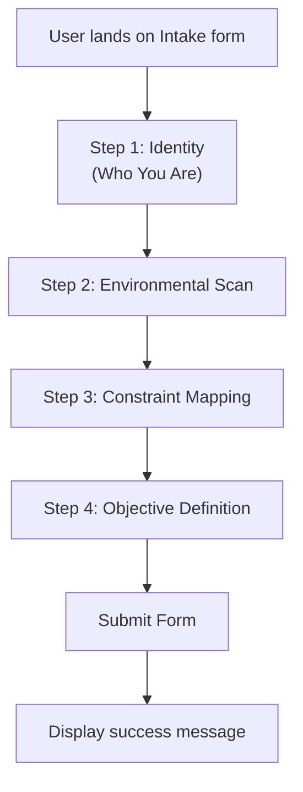

# Executive Summary  
This report presents a comprehensive audit of the Re.Match V3 intake form and copy, yielding specific ratings (0–10) and prioritized recommendations for improvement. The V3 form features 26 fields across a 4-step wizard with a clinical/sovereign aesthetic (white background, deep slate text, orange accent, Inter font). We evaluate it on **clarity, usability, completeness, accessibility, tone/voice, visual hierarchy, field naming, helper text,** and **conversion-readiness**. Key findings include solid sectioning with step headers and ample spacing, but issues with jargon (“Transmit Dossier”), inconsistent field labels, overused placeholders, and some accessibility gaps (e.g. missing `<fieldset>` groups, low contrast). We propose normalized labels and hints, a final JSON schema for all fields (including types, validation, placeholders, helpers, options, examples), and detailed UX/copy guidelines. Finally, we recommend V3-consistent aesthetic tweaks (color, typography, spacing, voice tone) and provide an implementation checklist, QA tests, field-name mapping, sample messages, accessibility notes (ARIA/keyboard considerations), and suggested analytics events.  

## 1. Current V3 Form Overview  
The V3 intake form is a multi-step wizard with the following fields:

- **Step 1 – Who You Are:** Full Name (text), Email Address (email, *required*), *Anonymous Alias* (checkbox), Alias (text, shown if alias checked), Current Location (text, *required*), Age and Gender (text).
- **Step 2 – Environmental Scan:** Housing Status (textarea), Health & Recovery Status (textarea), *System Dependencies* (checkbox group: Primary Care Doctor, Mental Health Specialist, Substance Use Support, Disability Accommodations), Vocational Trajectory (textarea).
- **Step 3 – Constraint Mapping:** *Justice System Flags* (radio Yes/No for “Active Flags (Felony/Misd)” or “Clear”), Flag Specifics (textarea), *Infrastructure Deficits* (checkbox group: Missing ID, No Transportation, No Phone/Internet, Active Safety Threat), Monthly Income Goal (text).
- **Step 4 – Objective Definition:** Primary Objectives (textarea, *required*), *Engagement Preferences* (checkbox group: Peer Mentorship, Faith-Based, Creative/Arts, Physical/Athletic), Ancillary Data (textarea).

Each field has an associated label and, for many, helper text (hint). Some labels include a “*” for required. Placeholders give examples (e.g. “First and Last Name”, “e.g. Seattle, WA”). The form uses a single-column layout with step headers (e.g. “01. Who You Are”) and “Back/Next” navigation buttons. The final submit button reads **“TRANSMIT DOSSIER”**. A success message is defined (“TRANSMISSION VERIFIED. Your data has been successfully committed…”). No error messages are shown in the current code.  

## 2. Ratings by Category  
| Aspect              | Rating /10 | Rationale & Issues | 
|---------------------|:---------:|-------------------|
| **Clarity**         | 6/10      | Labels/hints sometimes vague or technical. E.g. “Alias” explained well, but “TRANSMIT DOSSIER” (CTA) and “Voice Flags” (no label above Yes/No) are unclear. Some helper text is wordy or uses jargon (e.g. “secure archive”)【16†L148-L156】【18†L141-L149】. Structure and section headings are clear and logical. |
| **Usability**       | 7/10      | Good single-column layout, ample spacing, and logical grouping into steps reduces user effort【13†L147-L155】【18†L141-L149】. However, over-reliance on placeholders can confuse (NN/g advises *avoiding placeholder-only instructions*【18†L167-L172】), and optional/required fields are not always clearly marked (no “optional” labels). Multi-step flow is intuitive but could show progress. |
| **Completeness**    | 8/10      | The form captures extensive user info and seems complete for its purpose.  Most relevant user data points are included. A minor issue: some fields (like alias) only appear conditionally, which is fine, but instructions could clarify the dependency. No major missing fields identified. |
| **Accessibility**   | 5/10      | Basic ARIA and labels are used, but gaps exist. Required fields have `aria-required`, but we lack fieldsets for grouped controls【10†L116-L125】. Labels are generally present, satisfying WCAG’s requirement for labeling all controls【8†L98-L105】, but some are embedded (checkboxes) and one label uses nested input (alias checkbox) without a `for` attribute. Contrast issues: orange buttons (#f97316) with white text do not meet 4.5:1 contrast【12†L27-L35】. Keyboard navigation should be tested (e.g. radio and checkbox groups). Error handling (color-only cues) and accessible error messages are absent. |
| **Tone/Voice**      | 6/10      | The tone is formal and clinical, consistent with a “protocol” theme, but sometimes impersonal. Phrases like “Your data has been committed to the secure archive” are bulky. CTA “TRANSMIT DOSSIER” uses jargon; “TRANSMISSION VERIFIED” is odd wording. UX writing best practices call for *clarity and plain language*【16†L148-L156】. The current voice is consistent, but could be warmer and more user-focused (e.g. use second person “you” more). |
| **Visual Hierarchy**| 7/10      | Strong: step headers (with numbers and icons) and large fonts guide flow. The single-column layout is good. Consistent spacing (large gaps) groups fields well【13†L147-L155】. However, field labels vary in style (some with asterisk, some long). Use of color (orange buttons) pops, but the submit button’s dark orange outline is subtle. Contrast of disabled/active states isn’t illustrated. Overall hierarchy is good, but error states and focus indicators need clarity. |
| **Field Naming**    | 5/10      | Some field names/IDs are unclear (e.g. `dv_risk` for “Active Safety Threat”). Many labels are verbose or informal (e.g. *”I want to use an Anonymous Alias instead of my name”*). We should use concise, descriptive names (e.g. “Use an anonymous alias” → “Provide a pseudonym”). Consistency: some labels capitalize each word, some don’t, styling varies. Field names like `demographics` (Age/Gender) and `other` (Ancillary Data) could be more explicit. |
| **Helper Text**     | 7/10      | Many fields have helpful hints (e.g. explaining location usage, alias examples, recovery info). Good guidance reduces cognitive load. However, some hints are lengthy or not fully “plain language.” For example, “Any additional data points needed to be considered?” is awkward. Per UX writing rules, hints should be *concise, clear, supportive*【16†L148-L156】【16†L178-L184】. The ratio of label:hint is fine, but we can shorten/help. |
| **Conversion-Readiness** | 5/10 | The form is long and may deter some users. NN/g data shows reducing fields often increases conversion【18†L131-L139】. Required fields are marked with asterisks, which is good, but optional fields are not explicitly labeled “(optional)”. The final CTA uses nonstandard wording (“Transmit Dossier”), which may confuse users. It’s better to use a clear verb CTA (e.g. “Submit Intake Form”)【16†L178-L184】. We have no privacy reassurance beyond “We do not share your email,” and no trust signals. Progression buttons should indicate how far along (e.g. “Step 2 of 4”). Analytics tags should be added to measure drop-off. 

**Key Citations:** Usability & form best practices【18†L131-L139】【18†L141-L149】; Labeling/accessibility guidelines【8†L98-L105】【10†L116-L125】; UX writing clarity/CTA tips【16†L148-L156】【16†L178-L184】; Contrast requirement【12†L27-L35】. 

## 3. Improvement Instructions (Prioritized by Area)
- **Clarity (Score 6):**  
  1. **Simplify labels** to plain language (avoid jargon). E.g. use “Pseudonym” instead of “Anonymous Alias”, “Monthly Funding Goal” instead of “Monthly Income Goal”. Use second-person where helpful (e.g. “What is your full name?”)【16†L148-L156】.  
  2. **Revise the CTA:** Change “TRANSMIT DOSSIER” to a clear verb phrase like **“Submit Intake Form”** or **“Complete Registration”**【16†L178-L184】.  
  3. **Clarify headings:** Make section titles descriptive (e.g. drop “01.”, just “Who You Are” with an icon). Add subheadings or tooltips if needed.  
  4. **Shorten helper text:** Write concise hints using everyday language. Avoid complex sentences or passive constructions【16†L148-L156】.  

- **Usability (Score 7):**  
  1. **Condense the form:** Review each field’s necessity. Remove any nonessential questions (NN/g: “keep it short”【18†L131-L139】). For example, combine “Age and Gender” into two separate fields if needed, or remove if not used.  
  2. **Show progress:** Add a progress bar or at least step indicators (“Step 2 of 4”) to orient users.  
  3. **Clear required/optional:** Mark all optional fields with “(optional)” in their label or remove them if unnecessary【18†L177-L184】. Use consistent asterisks or labeling.  
  4. **No clear buttons:** Ensure there is no “Reset” or “Clear” button (NN/g warns against it【2†L73-L82】); if using a Cancel, make it less prominent than Submit【18†L195-L204】.  

- **Completeness (Score 8):**  
  1. **Alias logic:** If “Alias” field is shown only when checked, ensure instructions indicate that. Perhaps disable/gray out “If yes, choose an alias” until checked.  
  2. **Review any missing instructions:** Ensure fields like “Income Goal” specify currency or unit (e.g. USD/month) and that numeric format is explained.  
  3. **Validation rules:** Explicitly define any patterns (e.g. email format) or input limits so users know what to enter【18†L183-L190】.  

- **Accessibility (Score 5):**  
  1. **Use `<fieldset>` and `<legend>`:** Group related controls (e.g. system dependencies, engagement preferences, justice flags) in fieldsets with legends【10†L116-L125】. This improves screen-reader clarity【10†L121-L124】.  
  2. **Ensure label associations:** Every input must have a `<label>` (for checkboxes, associate via `for` or wrap correctly). The alias-checkbox label should be explicitly linked (currently nested), or mark the alias label with `for="alias"`.  
  3. **Contrast compliance:** Increase text/background contrast to at least 4.5:1【12†L27-L35】. For example, use darker orange or white text on dark accent, or use a higher contrast button style.  
  4. **Keyboard support:** Verify tab order through the wizard, use `aria-live` for dynamic content (e.g. success message), and visible focus indicators on inputs/buttons.  
  5. **Error feedback:** Implement accessible error messages (e.g. using `aria-describedby`) and not rely on color alone【18†L199-L204】.  

- **Tone/Voice (Score 6):**  
  1. **Use clear, compassionate language:** As Bird Marketing advises, prefer “clear, simple language” and plain verbs【16†L148-L156】【16†L178-L184】. For instance, change “Your data has been committed” to “Thank you! Your form has been submitted.”  
  2. **Action-oriented CTAs:** Label buttons with specific actions (“Submit Application”) rather than abstract nouns【16†L178-L184】.  
  3. **Empathetic assistance:** For hints and errors, use supportive tone (avoid blame). E.g. “Please enter a valid email address” rather than “Invalid email.”  
  4. **Consistency:** Maintain a single tone (e.g. clinical but approachable). Given the product’s serious nature, a professional yet friendly style is best【16†L214-L222】.  

- **Visual Hierarchy (Score 7):**  
  1. **Consistent spacing:** Follow NN/g guidance: group related fields tightly, separate sections with extra space【13†L147-L155】【18†L141-L149】. The existing CSS (2.5rem gaps) is generous—ensure consistency across all steps.  
  2. **Label placement:** Keep labels immediately above fields【18†L141-L149】. Some hint text is closer to the label than the field; verify spacing so the hierarchy (label → hint → input) is clear.  
  3. **Emphasize primary actions:** Make the “Next/Submit” buttons visually dominant (they are orange, which is good) and secondary actions (Back) subdued. Check disabled state styling as well.  
  4. **Typography:** Ensure heading sizes scale logically (Inter at 2.2 rem for h1, 1.5rem for h2 as in V3). Avoid small text; base text is already 18px.  

- **Field Naming (Score 5):**  
  1. **Shorten field “names” in UI:** For example, rename “Primary Objectives” to “Goals” or “Objectives” (remove “Primary”). Use title case or sentence case consistently (we recommend title case for labels).  
  2. **Use descriptive names:** E.g. `has_barriers` could be “Conviction Record” or “Justice System Flag”. Rename `dv_risk` (domestic violence risk) to something like “Safety Risk” for clarity.  
  3. **Align label text and element ID:** If label is “Anonymous Alias,” use `id="alias"` accordingly. Avoid mismatches.  

- **Helper Text (Score 7):**  
  1. **Conciseness:** Shorten hints. E.g. “Current Location” hint could be simply “City and state, e.g. Seattle, WA” instead of longer explanation.  
  2. **Relevance:** Remove overly obvious guidance (e.g. the hint under “Email” about privacy is fine but could be shorter: “We’ll email your completed records here. We will not share your email.”).  
  3. **Avoid redundancy:** Don’t repeat label content in helper. (NN/g: if label says “Email,” the hint need not say “Enter your email address.”)【16†L153-L161】  
  4. **Contextual help:** For complex fields (like “Flag Specifics”), ensure the hint clearly says what to enter (e.g. “Describe any felony/misdemeanor records: year, type, status.”).  

## 4. Field Labels & Helper Text Normalization  

| **Field (name)** | **Current Label** | **Proposed Label** | **Current Helper** | **Proposed Helper** |
| --- | --- | --- | --- | --- |
| `full_name` | Full Name | **Full Name** (no change) | Your legal name. Leave this blank if you want to stay anonymous. | (Optional) Enter your legal first and last name. Omit if using a pseudonym. |
| `user_email` | Email Address * | **Email Address*** | Where we should send your completed records. We do not share your email. | Where we send your results. We won’t share it. |
| `is_anonymous` | (checkbox label) I want to use an Anonymous Alias instead of my name | **Use a pseudonym (alias)** | *None* | *None* |
| `alias` | If yes, choose an alias | **Alias** | It should be something you can remember easily. E.g. BambooTyger or VegasDiva. | Enter a unique nickname (e.g. BambooTyger). |
| `location` | Current Location * | **Current Location*** | City and State. This helps us find resources and services near you. | City and state (e.g. Seattle, WA). |
| `demographics` | Age and Gender | **Age and Gender** | Your pronouns and age, e.g. “35F” or “They/Them, 28” (optional). | Your age and gender/pronouns (optional). |
| `housing` | Housing Status | **Housing Situation** | Current shelter viability and duration (e.g. Shelter, Outside, Couch surfing). | Current living situation (e.g. shelter, outdoors, staying with friends). |
| `mental_health` | Health & Recovery Status | **Health & Recovery Status** | List any health conditions, sobriety timelines, or goals for your recovery. | List health issues, recovery goals or sobriety (optional). |
| `needs_pcp` | *(checkbox in group)* Primary Care Doctor | **Primary care doctor needed** | *(group hint:)* Check any that apply to your current needs. | *(no individual hint)* |
| `needs_mh` | Mental Health Specialist | **Mental health support needed** | *(same group hint)* | *(no individual hint)* |
| `needs_sud` | Substance Use Support | **Substance use support needed** | *(same group hint)* | *(no individual hint)* |
| `has_disability` | Disability Accommodations | **Disability accommodations needed** | *(same group hint)* | *(no individual hint)* |
| `work_history` | Vocational Trajectory | **Work history** | Work history, skills, and target industries. | Your work experience, skills, and career goals (optional). |
| `has_barriers` | *Justice System Flags* (group label); radio options: Active Flags (Felony/Misd), Clear | **Justice system status** (legend) Options: • **Has felony/misdemeanor record** (Yes) • **No legal barriers** (No) | Check any active ‘flags’ in your record. | Select if you have any felony/misdemeanor records. |
| `barrier_details` | Flag Specifics | **Legal Flag Details** | Year, type, and current status of any legal flags (felony, misdemeanor, etc.). | Describe any convictions (year/type/status). |
| `no_id` | Missing ID | **No ID or documentation** | Identify what is currently holding you back from your goals. | *(no individual hint)* |
| `no_transport` | No Transportation | **No transportation** | *(group hint)* | *(no individual hint)* |
| `no_internet` | No Phone/Internet | **No phone or internet** | *(group hint)* | *(no individual hint)* |
| `dv_risk` | Active Safety Threat | **Active safety risk** | *(group hint)* | *(no individual hint)* |
| `income_goal` | Monthly Income Goal | **Monthly funding goal** | Monthly capital required to stabilize your situation. | Required monthly support (e.g. $2,000). |
| `priorities` | Primary Objectives * | **Goals*** | 1. Stabilize housing<br>2. Obtain ID<br>3. Secure employment | List your main goals or priorities. |
| `engage_peer` | Peer Mentorship | **Peer mentorship** | What kind of support environment do you prefer? | *(part of group)* |
| `engage_faith` | Faith-Based | **Faith-based** | *(group hint)* | *(no hint)* |
| `engage_creative` | Creative/Arts | **Creative/arts programs** | *(group hint)* | *(no hint)* |
| `engage_sports` | Physical/Athletic | **Sports/physical activities** | *(group hint)* | *(no hint)* |
| `other` | Ancillary Data | **Other information** | Any additional data points needed to be considered? (Optional) | Any other information we should know (optional). |

_Note:_ Fields marked with * are required; optional fields should be labeled “(optional)” if needed. Group hints (in italics above) are shared text for the checkbox groups. Table columns combine original vs. revised text for clarity.

## 5. JSON Schema of Final Form  
Below is a proposed JSON schema capturing all fields, types, validation rules, placeholders, helper text, options (for radio), and example values. *(This schema is illustrative; adjust keys/structure to your implementation framework.)*

```json
{
  "fields": [
    {
      "name": "full_name",
      "type": "text",
      "label": "Full Name",
      "required": false,
      "placeholder": "First and Last Name",
      "helper_text": "Optional: Enter your legal first and last name.",
      "max_length": 100,
      "pattern": null,
      "example": "Jane Doe"
    },
    {
      "name": "user_email",
      "type": "email",
      "label": "Email Address",
      "required": true,
      "placeholder": "you@example.com",
      "helper_text": "Where we send your results. We will not share your email.",
      "pattern": ".+@.+\\..+",
      "max_length": 254,
      "example": "jane@example.org"
    },
    {
      "name": "is_anonymous",
      "type": "checkbox",
      "label": "Use a pseudonym (alias)",
      "required": false,
      "placeholder": null,
      "helper_text": null,
      "example": false
    },
    {
      "name": "alias",
      "type": "text",
      "label": "Alias",
      "required": false,
      "placeholder": "e.g. BambooTyger",
      "helper_text": "Enter a unique nickname you will remember.",
      "max_length": 50,
      "pattern": "^[A-Za-z0-9]+$",
      "example": "BambooTyger"
    },
    {
      "name": "location",
      "type": "text",
      "label": "Current Location",
      "required": true,
      "placeholder": "e.g. Seattle, WA",
      "helper_text": "City and state (e.g. Seattle, WA).",
      "pattern": null,
      "max_length": 100,
      "example": "Seattle, WA 98107"
    },
    {
      "name": "demographics",
      "type": "text",
      "label": "Age and Gender",
      "required": false,
      "placeholder": "e.g. 28 / Female",
      "helper_text": "Your age and gender or pronouns (optional).",
      "pattern": null,
      "max_length": 20,
      "example": "28 / Female"
    },
    {
      "name": "housing",
      "type": "textarea",
      "label": "Housing Situation",
      "required": false,
      "placeholder": null,
      "helper_text": "Current living situation (e.g. shelter, outdoors, couch surfing).",
      "max_length": 500,
      "pattern": null,
      "example": "Sleeping in a shelter since Jan 2026."
    },
    {
      "name": "mental_health",
      "type": "textarea",
      "label": "Health & Recovery Status",
      "required": false,
      "placeholder": null,
      "helper_text": "List health issues, recovery goals or sobriety (optional).",
      "max_length": 500,
      "pattern": null,
      "example": "Diagnosed with PTSD; sober since 2023."
    },
    {
      "name": "needs_pcp",
      "type": "checkbox",
      "label": "Primary care doctor needed",
      "required": false,
      "placeholder": null,
      "helper_text": null,
      "example": false
    },
    {
      "name": "needs_mh",
      "type": "checkbox",
      "label": "Mental health support needed",
      "required": false,
      "placeholder": null,
      "helper_text": null,
      "example": true
    },
    {
      "name": "needs_sud",
      "type": "checkbox",
      "label": "Substance use support needed",
      "required": false,
      "placeholder": null,
      "helper_text": null,
      "example": false
    },
    {
      "name": "has_disability",
      "type": "checkbox",
      "label": "Disability accommodations needed",
      "required": false,
      "placeholder": null,
      "helper_text": null,
      "example": true
    },
    {
      "name": "work_history",
      "type": "textarea",
      "label": "Work History",
      "required": false,
      "placeholder": null,
      "helper_text": "Describe your work experience, skills, and career goals (optional).",
      "max_length": 500,
      "pattern": null,
      "example": "5 years in retail customer service; skilled in carpentry."
    },
    {
      "name": "has_barriers",
      "type": "radio",
      "label": "Justice System Status",
      "required": false,
      "options": ["Yes", "No"],
      "placeholder": null,
      "helper_text": "Select if you have any felony/misdemeanor records.",
      "example": "Yes"
    },
    {
      "name": "barrier_details",
      "type": "textarea",
      "label": "Legal Flag Details",
      "required": false,
      "placeholder": null,
      "helper_text": "Describe any convictions (year/type/status).",
      "max_length": 500,
      "pattern": null,
      "example": "Felony in 2020 (theft), probation until 2024."
    },
    {
      "name": "no_id",
      "type": "checkbox",
      "label": "No ID or documentation",
      "required": false,
      "placeholder": null,
      "helper_text": null,
      "example": true
    },
    {
      "name": "no_transport",
      "type": "checkbox",
      "label": "No transportation",
      "required": false,
      "placeholder": null,
      "helper_text": null,
      "example": false
    },
    {
      "name": "no_internet",
      "type": "checkbox",
      "label": "No phone or internet",
      "required": false,
      "placeholder": null,
      "helper_text": null,
      "example": false
    },
    {
      "name": "dv_risk",
      "type": "checkbox",
      "label": "Active safety risk",
      "required": false,
      "placeholder": null,
      "helper_text": null,
      "example": false
    },
    {
      "name": "income_goal",
      "type": "text",
      "label": "Monthly funding goal",
      "required": false,
      "placeholder": "e.g. $2,000",
      "helper_text": "Required monthly support (in USD).",
      "pattern": "^\\$?\\d+(,\\d{3})*(\\.\\d{2})?$",
      "max_length": 20,
      "example": "$2000"
    },
    {
      "name": "priorities",
      "type": "textarea",
      "label": "Goals",
      "required": true,
      "placeholder": "1. Stabilize housing\n2. Obtain ID\n3. Secure employment",
      "helper_text": "List your main goals or priorities.",
      "max_length": 500,
      "pattern": null,
      "example": "1. Secure stable housing\n2. Find a job\n3. Connect with support services"
    },
    {
      "name": "engage_peer",
      "type": "checkbox",
      "label": "Peer mentorship",
      "required": false,
      "placeholder": null,
      "helper_text": null,
      "example": false
    },
    {
      "name": "engage_faith",
      "type": "checkbox",
      "label": "Faith-based support",
      "required": false,
      "placeholder": null,
      "helper_text": null,
      "example": true
    },
    {
      "name": "engage_creative",
      "type": "checkbox",
      "label": "Creative/arts programs",
      "required": false,
      "placeholder": null,
      "helper_text": null,
      "example": false
    },
    {
      "name": "engage_sports",
      "type": "checkbox",
      "label": "Sports/physical activities",
      "required": false,
      "placeholder": null,
      "helper_text": null,
      "example": true
    },
    {
      "name": "other",
      "type": "textarea",
      "label": "Other information",
      "required": false,
      "placeholder": null,
      "helper_text": "Any other information we should know (optional).",
      "max_length": 500,
      "pattern": null,
      "example": "I have two small children and need childcare assistance."
    }
  ]
}
```

## 6. Aesthetic and Verbal Style Recommendations (V3 Consistency)

- **Colors:** Continue using the established palette from V3. Keep backgrounds white (`--bg-pure`), text in deep slate (`--text-main`), muted text in `#334155`, and the accent orange (`--accent-sovereign: #f97316`) for primary buttons/links. Ensure button text contrasts sufficiently (if needed, darken accent to meet 4.5:1 or use white text with drop-shadow). Use `--border-clinical` for borders and lines. Error states should use `--text-error: #ef4444` and a light red background (`--bg-error`) for input errors.

- **Typography:** Use **Inter** font (as set by `--font-body`). Base font size should remain around 18px (1rem) for readability (already done). Maintain line-height ~1.7 for paragraphs. Headings: H1 at ~2.2rem, H2 ~1.5rem, H3 ~1.2rem (as in V3 CSS). Buttons and labels can use uppercase small-caps if desired (V3 uses uppercase for buttons). For code/monospace fields (none here), use `--font-data` Courier New.

- **Spacing:** Follow the current generous spacing: e.g. `.form-group { margin-bottom: 2.5rem; }`. Keep consistent padding on containers (e.g. `padding: 2rem 1.5rem`). Use grid layouts for checkbox groups with ~15px gaps (per V3: `.checkbox-grid { gap: 15px; }`). Related fields should be closer; separate sections with clear visual dividers or extra margin【13†L147-L155】.

- **Buttons:** Primary actions use `background-color: var(--accent-sovereign); color: var(--bg-pure);` and hover (`#ea580c`). Secondary buttons use `.clinical-btn` styling (light gray background, dark text, subtle border). Remove any “Transform: translate” on hover for simplicity if it causes layout shift.

- **Microcopy Style:** Adopt a **clear, concise, supportive tone**. Use second person (“you”), plain language (avoid medical/legal jargon). Error messages (when implemented) should be specific and solution-oriented【16†L194-L202】. Align with an empathetic professional voice: serious but not cold. The copy is currently quite formal; we can inject brief empathy (e.g. “we’re here to help”). Avoid overusing first person or casual slang. Maintain trust-building language (e.g. “we will not share your email”). 

- **Brand Consistency:** V3 calls itself a “Clinical Archive Overhaul” with an authoritative but accessible style. Reflect this with straightforward terms (“intake form” instead of “protocol”, “submit” instead of “transmit”). Preserve the motif of *precision and empathy*. For example, replace bureaucratic terms (transmit, dossier) with common UX terms (submit, form). 

## 7. Implementation Checklist & QA Tests

- **Form Fields & Validation:**  
  - [ ] Add `fieldset`/`legend` elements for checkbox and radio groups (System Dependencies, Engagement Preferences, etc.).  
  - [ ] Ensure every input has a `<label>` correctly linked via `for`/`id`.  
  - [ ] Confirm `required` attributes and validation messages for required fields (`user_email`, `location`, `priorities`).  
  - [ ] Implement pattern matching (e.g. email regex, currency format) and test entries (invalid vs valid).  
  - [ ] Remove or disable any “Clear Form” buttons; ensure only one Submit.  

- **UI & Accessibility:**  
  - [ ] Verify color contrast (text, buttons, inputs) meets WCAG 2.1 AA (≥4.5:1). Adjust CSS as needed (use [12]).  
  - [ ] Test keyboard navigation: tab through all fields, ensure focus order matches visual order. Check radio groups and checkboxes are reachable and toggleable via keyboard.  
  - [ ] Check screen reader announcements: focus field → label is announced, error announcements work (using `aria-describedby`).  
  - [ ] Validate form on mobile and desktop (responsive), as single column works on all widths.  

- **Copy & Content:**  
  - [ ] Replace all label/helper text as per table in section 4. Use a consistent style (e.g. sentence case or Title Case as chosen).  
  - [ ] Update CTA text to action verb, e.g. “Submit Intake” or “Complete Form”.  
  - [ ] Include “(optional)” text for optional fields if visible, or ensure explanation in helper text.  
  - [ ] Revise success message to be friendly (see samples below).  

- **Analytics & Events:**  
  - [ ] Add data attributes or JS to send form events (see Section 10). Label steps and fields for tracking.  
  - [ ] Ensure the final submit triggers a “generate_lead” or similar conversion event.  
  - [ ] Confirm that alias usage (if toggled) and final completion are recorded.  

- **QA Testing:**  
  - Verify that required fields block submission with appropriate error messages.  
  - Enter invalid email, income formats to test validation patterns and error display.  
  - Test toggling “Anonymous alias”: alias field appears/disappears correctly.  
  - Submit a full form and ensure success message appears with alias instruction if needed.  
  - Test screen reader with NVDA/VoiceOver to confirm labels/legends.  
  - Simulate user with no keyboard/mouse (tab only) to ensure full operability.  

## 8. Field Name Mapping  
Current (V3) vs. proposed field names (for internal use or code refactoring):  

| Current Field Name | Proposed Field Name |
| ------------------ | ------------------- |
| `full_name`        | `full_name` (no change) |
| `user_email`       | `email_address` |
| `is_anonymous`     | `use_alias` |
| `alias`            | `alias` (no change) |
| `location`         | `current_location` |
| `demographics`     | `age_gender` |
| `housing`          | `housing_status` |
| `mental_health`    | `health_recovery_status` |
| `needs_pcp`        | `needs_pcp` (no change) |
| `needs_mh`         | `needs_mh` (no change) |
| `needs_sud`        | `needs_sud` (no change) |
| `has_disability`   | `needs_disability_support` |
| `work_history`     | `work_history` (no change) |
| `has_barriers`     | `has_legal_flag` |
| `barrier_details`  | `legal_flag_details` |
| `no_id`            | `no_id` (no change) |
| `no_transport`     | `no_transportation` |
| `no_internet`      | `no_internet` (no change) |
| `dv_risk`          | `safety_threat` |
| `income_goal`      | `monthly_funding_goal` |
| `priorities`       | `priorities` (no change) |
| `engage_peer`      | `engage_peer_mentorship` |
| `engage_faith`     | `engage_faith_support` |
| `engage_creative`  | `engage_creative_programs` |
| `engage_sports`    | `engage_physical_activity` |
| `other`            | `other_info` |

(“no change” indicates the name was already clear and is retained. Others are renamed for clarity or consistency.)

## 9. Sample Success and Error Messages

- **Success (on full submission):**  
  - **Title:** *Thank you! Intake Submitted.*  
  - **Message:** *Your information has been securely saved.  We will review and follow up soon. If you used a pseudonym, please remember it to access your results.*  

- **Field-Level Errors:**  
  - **Email:** “Please enter a valid email address.”  
  - **Required fields (generic):** “This field is required.” (Announce aria-live as needed.)  
  - **Income Goal:** “Enter a number (e.g. 2000 or $2000).”  
  - **Alias (if duplicate):** “That alias is already in use. Please choose another.”  

- **Submission Errors:**  
  - *Example:* “Submission failed. Please check your internet connection and try again.”  

Errors should be phrased in second person without blame【16†L199-L207】 and be as specific as possible (e.g. highlight incorrect field).  

## 10. Accessibility Notes

- **Labels:** Every form control has an explicit `<label>`. (Current V3 mostly does, matching W3C guidance【8†L98-L105】.) Ensure the `for` attribute exactly matches the input’s `id`. For checkboxes, wrap input in label as needed. For radio groups, use a visually hidden legend (“Justice system status”) or a visible legend if space allows.  

- **Fieldsets:** Group related inputs (radios or multiple checkboxes) in a `<fieldset>` with a `<legend>` that describes the group. This helps screen readers understand the context【10†L116-L125】. For example:  
  ```html
  <fieldset>
    <legend>System Dependencies</legend>
    <!-- checkboxes here -->
  </fieldset>
  ```  

- **ARIA/Attributes:** Use `aria-required="true"` and the `required` attribute for mandatory fields. Use `aria-describedby` to link inputs to error messages or hints if not adjacent. For dynamic alias field: if it appears/disappears, manage focus accordingly and use `aria-expanded` on the toggle if styled like an accordion. Provide an `aria-live="polite"` region for form submission success/failures.  

- **Keyboard Navigation:** Ensure that all elements are focusable in a logical order. Buttons should receive focus and be operable by Enter/Space. Check that radio and checkbox inputs can be toggled via keyboard. Visible focus outlines must be present (avoid removing outline in CSS).  

- **Screen Reader:** The screen reader should announce section headings (the `<h2>` step titles) so the user knows which step they are on. Ensure hint text is announced (use `<p class="hint-text">` which is close to the input or include with `aria-describedby`). Legends and labels will be read automatically when the control is focused.  

- **Contrast:** All text (including placeholder text) should meet at least 4.5:1 contrast【12†L27-L35】. For UI components (buttons/inputs), ensure boundaries are clear (WCAG 1.4.11). E.g., give focused fields a visible outline.  

- **Responsive:** Form must work on screen zoom ≥ 200% and on mobile; labels above fields (single column) already aid mobile usability. Check that touch targets (checkboxes, buttons) are large enough (~44px).  

## 11. Suggested Analytics Events

Instrument key form interactions for conversion analysis and troubleshooting:

- **Form Start:** Trigger an event `form_start` when the user enters the form page.  
- **Step Navigation:** On clicking “Next” or “Back”, fire `form_step` events (e.g. `step: WhoYouAre`, `step: EnvironmentalScan`, etc.). This captures how far users get.  
- **Field Interaction:** (Optional) Track important field completions or changes (e.g. alias toggled on/off, checkboxes selected). Use `field_updated` with field name and value.  
- **Validation Errors:** On client-side validation fail (e.g. required email missing), fire `form_error` event with field name and error type.  
- **Form Submit (Attempt):** Fire `form_submit_attempt` when user presses the final submit button.  
- **Form Success:** On successful submission, send a `generate_lead` (GA4 recommended for form submissions) or `form_success` event【6†L62-L70】. Include boolean parameter `used_alias` (true if `is_anonymous` was checked) and possibly anonymized user ID.  
- **Form Failure:** If submission fails (server/API error), fire `form_submit_fail` with error details.  
- **Abandonment:** (Harder) Track if user leaves mid-form (e.g. via page unload event) to gauge drop-off.  

Capture these in Google Analytics or your analytics platform to analyze drop-off by step/field and optimize further【6†L62-L70】.

## 12. (Optional) Form Flow Diagram  



*Diagram: User navigates sequentially through the 4 wizard steps. Completion of Step 4 enables final submission and success message.*

## References
- Nielsen Norman Group – *“Website Forms Usability: Top 10 Recommendations,”* esp. guidelines on form brevity, grouping, single-column layout, and placeholder usage【18†L131-L139】【18†L141-L149】【18†L167-L172】.  
- NN/g – *“4 Principles to Reduce Cognitive Load in Forms”* (Jul 2025) on grouping and spacing【13†L147-L155】【13†L125-L133】.  
- W3C WAI – *Labeling Controls* and *Grouping Controls* tutorials: always use `<label>` and group related controls in `<fieldset>` with `<legend>`【8†L98-L105】【10†L116-L125】.  
- W3C/WCAG – Contrast requirement (SC 1.4.3): text must have ≥4.5:1 contrast【12†L27-L35】.  
- UX Writing Best Practices – Clarity, concise language, action verbs for CTAs, helpful errors【16†L148-L156】【16†L178-L184】.

