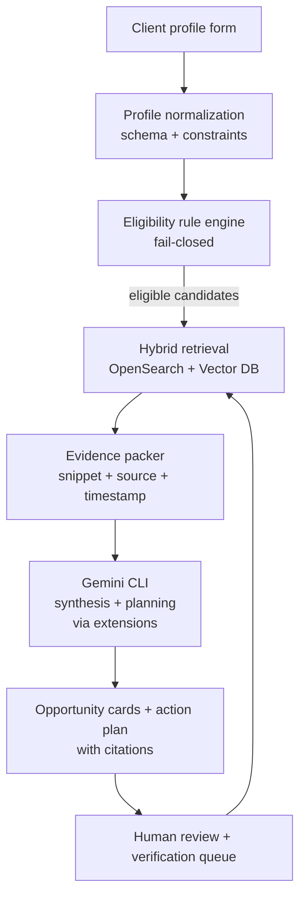

# Using Gemini CLI and extensions without reinventing the wheel

## Executive summary

You’re right: if you already have **Gemini CLI + extensions**, you can avoid rebuilding large parts of the “agent UX” and even some retrieval/browsing tooling. The best way to leverage what you have is to treat Gemini as a **replaceable reasoning/synthesis layer** and keep the rest of your system as **deterministic infrastructure** that you control: eligibility rules, canonical data models, auditable provenance, and reproducible indexing. This separation is consistent with modern retrieval‑augmented approaches, where the system’s reliability comes from explicit retrieval + evidence, not from the model’s internal memory. citeturn8search2turn8search6

You can reuse Gemini CLI heavily for:
- interactive deep research loops (question decomposition, follow‑up questions, synthesis),
- drafting (action plans, outreach scripts, summaries),
- code scaffolding and rapid prototyping,

while still relying on your own stack for:
- **100% criteria matching** (hard constraints),
- storage/indexing (vector + lexical),
- source ingestion and normalization,
- privacy/security boundaries and audit logs. citeturn15search6turn9search12turn9search3

## What you can reuse directly with Gemini CLI

Even without assuming any specific Gemini capability beyond “LLM + extensions,” there are high-value places to plug it in so you don’t rebuild agent features from scratch:

**Deep research orchestration and synthesis**
- Use Gemini to run the iterative “research loop” (break down a category question into sub-questions; decide which sources to consult next; synthesize findings into a structured report).
- You can mirror the well-known “planner → executor → publisher” pattern used by open-source research agents, but implement it as prompts + extension calls rather than a bespoke agent framework. citeturn17view3

**Grounded report generation with citations**
- You can reuse existing “report generator” patterns from STORM/GPT Researcher: produce long-form outputs where each claim is attached to its supporting evidence snippet and source reference. citeturn17view1turn17view3  
- Conceptually, this matches the point of retrieval-augmented generation: generation should be conditioned on retrieved evidence so it can be updated and traced. citeturn8search2turn8search14

**Human-in-the-loop workflows**
- Gemini CLI can be the interactive surface for review/edit/approval steps (especially early-stage).
- For long-running, stateful workflows you can later formalize this using a graph runtime (e.g., LangGraph’s human-in-the-loop and durable execution ideas), but you don’t need to start there. citeturn15search25turn15search1

## What you should still build yourself for “production-capable” reliability

This is the part you *don’t* want to delegate to “an agent,” because it’s where correctness, repeatability, and privacy live.

**Deterministic eligibility and “100% criteria match”**
- Eligibility should be a strict rule engine operating over a schema of verified fields (fail closed).
- LLMs should only propose extracted fields or interpretations; the system should validate against source text or authoritative API fields before declaring “100% match.” This is especially important given known inaccuracies that can exist in real-world directories (e.g., treatment locator listings needing re-verification). citeturn6search28turn8search2

**Index + retrieval infrastructure**
- Use a vector DB or hybrid search engine so you can retrieve across both meaning and exact terms (e.g., “must accept Medicaid,” “must be within 5 miles,” “felony-friendly” phrasing, etc.).
- OpenSearch provides a mature Docker deployment path; Milvus and Weaviate provide OSS vector DB options with published install guides. citeturn16search3turn16search0turn16search1

**Crawling/extraction pipelines**
- For sources without APIs, you still need ingestion tooling you control (politeness, rate limits, robots/ToS compliance, retries, structured extraction).
- Scrapy, Playwright, trafilatura, and Apache Tika are “wheel-not-reinventing” building blocks here. citeturn13search0turn13search1turn13search3turn13search4

**Security boundaries and auditability**
- Treat model outputs as untrusted; enforce boundaries at the tool/sandbox and permissions level (“defense in depth”). This principle is stated explicitly in LangChain’s security guidance and is broadly applicable regardless of which LLM you use. citeturn15search6turn15search23

## A pragmatic architecture that keeps Gemini as the “brain”

Below is a practical way to integrate Gemini CLI so you keep velocity while staying rigorous.

Key idea: **Gemini generates** plans and narratives, but **your system decides** what is eligible and what is “verified.”

This matches the “retrieval + evidence + generation” architecture described in foundational RAG work, where the non-parametric memory (index) provides updateability and provenance. citeturn8search2turn8search6

## How this also solves your ChatGPT export analytics

You can apply the same pattern to **ChatGPT exports** (your messages become the corpus). You don’t need to reinvent “analysis”; you need a clean ingestion + indexing model and a few well-defined extraction tasks:

**Ingest**
- Parse exports → normalize to: conversation_id, timestamp, role (user/assistant), message text, attachments/links.

**Index**
- Create both:
  - lexical index (for exact recall of names/phrases),
  - vector index (for semantic grouping across huge conversations).  
This is the same underlying concept as semantic retrieval used in RAG. citeturn8search2turn8search1

**Extract**
- “All questions”: detect question sentences in user turns + classify intent (info-seeking, planning, debugging, etc.).
- “Inefficiencies”: find repeated questions, repeated context re-explanations, and loops where the same blockers recur.
- “High-yield endeavors not acted upon”: detect proposals/commitments (“I will…”, “next steps…”, “we should…”) that never receive follow-up messages.

**Generate**
- Use Gemini CLI to:
  - produce a taxonomy (“themes/projects/skills/problems”),
  - generate coherent “syntheses” (what you learned, what changed, what remains open),
  - draft content (blog posts, SOPs, checklists) grounded in your own corpus with citations to message IDs.

If you want the *STORM-style* experience for your exports (outline → long writeup with citations), STORM is explicitly built around that two-phase knowledge curation structure, and the same pattern can be implemented over your local indexed corpus. citeturn17view1turn17view0

## Minimal “don’t reinvent” checklist

- Use Gemini CLI for:
  - decomposition, synthesis, drafting, interactive review.
- Use OSS infra for:
  - crawling/extraction: Scrapy/Playwright + trafilatura + Tika. citeturn13search0turn13search3turn13search4  
  - indexing: OpenSearch for lexical + filters; Milvus/Weaviate/Chroma for vectors depending on scale. citeturn16search3turn16search0turn16search1turn16search2  
- Enforce:
  - eligibility constraints in code (fail closed),
  - provenance requirements (every critical statement cites evidence),
  - privacy-by-default (“keep only what you need”), especially for health/SUD data contexts. citeturn9search12turn9search2turn9search1