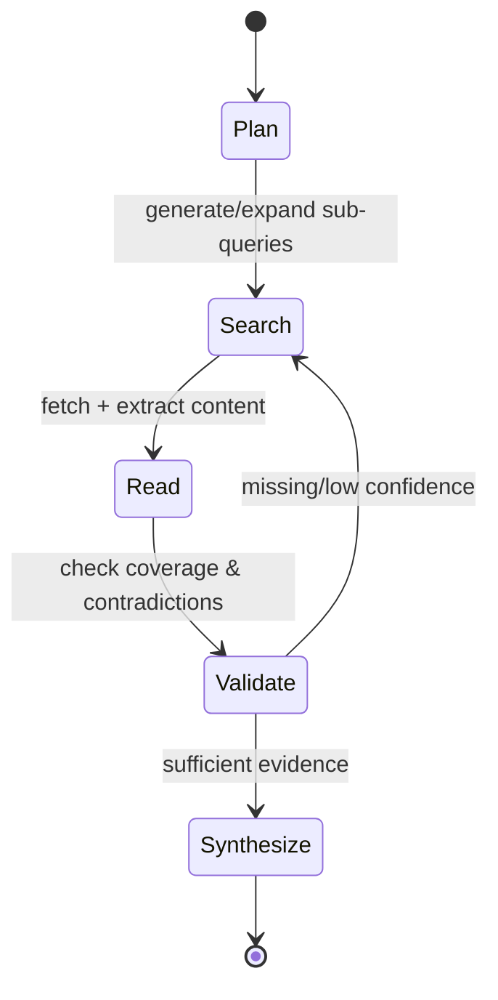

# Deep Research Search Tools and Alternatives to Standard Web Search

## Executive summary

“Deep research” tools sit at the intersection of (a) web discovery (finding the right sources), (b) web access and extraction (turning heterogeneous pages into clean, machine-usable text/data), and (c) synthesis (reasoning across sources with citations), typically in an iterative loop rather than a single query-response. The center of gravity has moved from *ranked links* to *end-to-end pipelines* that return structured outputs, grounded citations, and “agent traces” (sub-queries, reads, intermediate steps). This shift is visible both in foundational research (dense retrieval, RAG) and in production APIs (agentic search endpoints, research endpoints, extraction stacks). citeturn23search0turn23search1turn23search2turn20view0turn18view2

Across the four focal solutions, the most important practical distinction is **where the “search” happens**:

- **Firecrawl** is primarily a **web acquisition + extraction layer** (crawl/scrape/map/search + action/browsing), with an emphasis on yielding high-quality, LLM-ready page representations and handling hard-to-render pages via browser automation. Its blog and docs describe a custom browser stack and a “semantic index” of snapshots/embeddings/metadata used to improve speed and coverage, plus an open-source core with a hosted cloud tier that adds proxies, agent features, and a dashboard. citeturn6view0turn17view2turn22view2turn6view1turn17view1  
- **Exa** is a **neural web search engine sold as an API**, offering multiple search modes (including low-latency and agentic “deep” variants) and an asynchronous multi-step “research” pipeline. Exa’s documentation and blogs explicitly discuss custom embedding/reranking models, a vector database, and evaluation harnesses for web search quality (including RAG-oriented evals). citeturn5view1turn15view0turn20view3turn20view1turn15view3  
- **Tavily** positions itself as a **single “web access layer for agents” API** that unifies search, extraction, crawling/mapping, and an agentic research endpoint with streaming progress events. Its own evaluation materials emphasize factuality gains on SimpleQA using retrieval + a frontier model, and its docs formalize knobs for search depth, domain constraints, extraction depth, structured outputs, and citation formats. citeturn7view2turn7view1turn18view0turn18view2turn21view1  
- **Research GPTs** (as commonly implemented in the entity["company","OpenAI","ai lab"] ecosystem) are best understood as **agentic research workflows inside ChatGPT**: custom GPTs with instructions, optional attached “knowledge,” and optional “actions” (tool/API calls), plus a dedicated “deep research” mode that produces cited reports. This is a powerful *interactive* surface for iterative research and synthesis, but it is less transparent than dedicated search APIs about retrieval internals and is usually not designed for high-throughput programmatic crawling/search workloads. citeturn2view0turn3search2turn3search5turn24search0turn24search8  

No single product “ensures the ability to find anything and understand everything in totality” because completeness is bottlenecked by (1) index coverage/freshness, (2) extraction quality for dynamic or hostile pages, (3) evaluation of correctness/grounding, and (4) legal/ethical access constraints (robots, paywalls, licensing). Architecturally, best-in-class practice is a **layered stack**: (i) neural web discovery (search API), (ii) targeted extraction/crawling with a browser-grade layer, (iii) local indexing + retrieval (vector and/or hybrid), (iv) structured synthesis with citations, and (v) continuous evaluation with retrieval- and answer-level metrics. citeturn23search0turn23search35turn15view3turn18view2turn6view0  

## Taxonomy of deep research and alternative search paradigms

Deep-research systems can be decomposed into retrieval primitives and orchestration patterns that are well-studied in the IR/RAG literature, then productized into APIs and tools.

**Neural / semantic search** generally refers to retrieval using learned representations (embeddings or late-interaction scoring) rather than pure lexical matching. Dense dual-encoder retrieval (e.g., DPR) maps queries and passages into a shared vector space and retrieves nearest neighbors by similarity. citeturn23search1turn23search5 The BEIR benchmark highlights how different retrieval families (lexical, dense, late interaction, reranking) trade off robustness and compute cost in zero-shot settings; notably, strong reranking/late-interaction methods often win on accuracy but cost more. citeturn23search2

**Vector search** is the operational substrate for dense retrieval: storing vectors and querying nearest neighbors at scale. Libraries such as FAISS focus on efficient similarity search and indexing structures, including GPU acceleration and compression techniques for billion-scale workloads. citeturn23search3turn23search35 In production, “vector databases” and ANN indices become the memory layer behind semantic search, RAG, and entity discovery.

**Retrieval-Augmented Generation (RAG)** is the canonical paradigm for “comprehensive discovery + understanding”: an LLM’s parametric knowledge is augmented by a non-parametric corpus retrieved at inference time (often via dense retrieval over a vector index). The original RAG formulation explicitly emphasizes provenance and updatability by retrieving passages (e.g., from Wikipedia) and conditioning generation on them. citeturn23search0

**Multi-iterative / agentic search** is a control-flow shift: rather than running one search query and summarizing, the system plans, issues multiple sub-queries, reads candidate sources, then refines queries and synthesis until it reaches coverage or confidence thresholds. This shows up both in vendor “deep search” endpoints and in research benchmarks that stress web browsing and tool use (e.g., GAIA), where successful performance depends on repeated retrieval + reasoning steps. citeturn24search2turn20view0turn18view2

**Multi-hop retrieval and reasoning** is an especially relevant subcase: many real research questions require combining evidence across multiple documents (“hops”), motivating dedicated benchmarks and datasets such as MultiHop-RAG. citeturn24search7

From a systems perspective, the *tool landscape* can be mapped onto the pipeline stages:

- **Discovery (web-scale retrieval):** neural web search APIs, domain-specific search engines, re-ranking services. citeturn20view3turn7view0  
- **Acquisition (content access):** crawlers, browser automation, “extract” endpoints, anti-bot/proxy infrastructure. citeturn6view0turn8view0turn17view2  
- **Memory (indexing):** vector indices + metadata stores + deduplication/canonicalization. citeturn23search35turn23search0  
- **Synthesis (LLM orchestration):** structured output schemas, citation grounding, multi-agent pipelines. citeturn20view1turn18view0turn2view0  
- **Evaluation (rigor):** retrieval grading, RAG QA, end-to-end task evals; open benchmarks like SimpleQA and GAIA and vendor harnesses. citeturn24search8turn24search2turn15view3turn21view1  

## Profiles of focal products

### Firecrawl

**Official sources and positioning.** Firecrawl’s primary official surfaces include its product site, documentation, pricing, and open-source repositories. citeturn16search16turn17view2turn22view2turn16search21turn6view1 The legal entity disclosed in its privacy policy is entity["company","SideGuide Technologies, Inc.","firecrawl operator"] (d/b/a Firecrawl), and it describes itself as “a tool for collecting and enhancing LLM-ready data.” citeturn17view0

**Company background.** Firecrawl publicly states it is “backed by” entity["organization","Y Combinator","startup accelerator"] and advertises SOC 2 Type II certification on its enterprise materials. citeturn17view1turn17view0turn22view2 Its self-hosting documentation also states that Firecrawl is “a Mendable product,” linking it to entity["company","Mendable","ai support platform"]. citeturn6view1

**Core capabilities.** Firecrawl is best categorized as a **high-reliability web data/extraction API** with multiple primitives: scrape, crawl, map, search, and interactive browsing (click/type) for agent-controlled extraction. citeturn17view2turn17view1turn6view0 The enterprise page emphasizes “Markdown & JSON extraction,” plus “Crawl, Scrape, Map, Search operations,” and provides MCP access for LLM tools. citeturn17view1turn17view2 Firecrawl also offers an agent-oriented endpoint with selectable models (e.g., Spark 1 Mini/Pro) and an action agent (“FIRE-1”) for complex navigation. citeturn16search5turn16search17turn16search9turn16search29

**Architecture and disclosed internals.** Firecrawl’s blog describes two major infrastructure elements intended to improve quality and coverage: a “custom browser stack” that detects page rendering and supports dynamic JavaScript apps, PDFs, and other content types, and a “semantic index” described as containing “full page snapshots, embeddings, and structural metadata,” with a `maxAge` parameter supporting “as of now” versus “last known good copy” retrieval behavior. citeturn6view0  
For self-hosting, the repository provides explicit operational details: a Playwright microservice, optional proxy configuration, Redis-based queues, PostgreSQL configuration, and optional “AI features” requiring an OpenAI key or an OpenAI-compatible base URL; it also notes that self-hosted instances lack access to “Fire-engine” features (e.g., IP block handling / robot detection), and that `/search` defaults to Google unless configured to use a SearXNG endpoint. citeturn6view1

**Supported data sources and integrations.** Firecrawl primarily targets the public web and web-accessible documents; it explicitly supports PDFs and dynamic pages via browser infrastructure. citeturn6view0turn6view1 Its cloud offering adds “browser sandbox,” “actions,” and proxy enhancements beyond the open-source core. citeturn17view2

**UI/workflow.** Typical use is API-first (SDK/HTTP), with optional MCP server integration for tool-using LLM clients and a hosted playground/dashboard in the cloud tier. citeturn17view1turn17view2turn16search16turn6view2

**Pricing.** Firecrawl uses monthly subscription plans with a credit model; its rate-limit docs explicitly say it does not offer pure pay-as-you-go, with “auto-recharge” as a scaling mechanism. citeturn22view1 The pricing page states a free tier for the first 500 scraped pages (500 credits) and reiterates that there is no pay-per-use plan; it also describes credit rollover exceptions (auto-recharge credits and some annual enterprise arrangements) and clarifies that FIRE-1 agent requests are billed even if they fail. citeturn22view2

**Privacy and security.** Firecrawl’s enterprise page advertises “zero-data retention” and “Zero Day Retention,” describing immediate deletion of processed data and claiming SOC 2 Type II certification. citeturn17view1 However, its privacy policy (last revised Dec 26, 2024) describes collection and retention practices including analytics tooling, “caching and indexing,” and retaining PII until deletion is requested (and explicitly noting no recurring deletion policy at that time). citeturn17view0 The most rigorous reading is that Firecrawl may have **tier- or contract-specific** retention controls (notably “zero-data retention” appears under enterprise features), and the default privacy policy describes broader website/service data handling; for sensitive deployments, this implies you should verify plan-level retention semantics in writing (and/or self-host) rather than assuming universal ZDR. citeturn17view1turn17view0turn6view1

**Known limitations and failure modes.** Firecrawl’s own self-host documentation highlights functional gaps versus the cloud service (missing “Fire-engine” advanced anti-blocking features) and the operational burden of self-hosting (manual configuration, infrastructure management). citeturn6view1 More generally, any web extraction system is constrained by site-level blocking, robots/crawl controls, paywalls, and rendering complexity; Firecrawl’s emphasis on browser-based rendering and interactive actions is specifically a response to those limitations. citeturn6view0turn16search17turn17view2

### Research GPTs

**Definition and scope.** “Research GPTs” is not a single product name so much as an application pattern inside ChatGPT: custom GPTs configured for research tasks (with specialized instructions, optional attached “knowledge,” and optional actions/tools), plus the dedicated ChatGPT “deep research” experience that performs multi-step web research and returns cited reports. citeturn2view0turn3search2turn3search5

**Core capabilities.** At a high level, Research GPTs aim to provide:
- **Iterative discovery:** multi-step browsing/search cycles guided by the model’s plan. citeturn2view0turn3search2  
- **Comprehensive synthesis:** narrative reports with citations grounded in retrieved sources. citeturn2view0  
- **Tool-augmented operation:** calling web search and (optionally) other tools, including file retrieval when available. citeturn3search2turn3search5  
- **Customizable wrappers:** specialized GPTs can hard-code research workflows, include domain constraints, and structure outputs for repeatable analysis. citeturn2view0  

**Architecture (disclosed).** OpenAI’s public materials describe deep research primarily as an **agentic workflow**: models search/browse, read sources, then synthesize and cite. citeturn2view0turn3search2 In the broader literature, this corresponds to a multi-iterative retrieval + reasoning loop (plan → retrieve → read → refine → synthesize) rather than a single retrieval pass. citeturn24search2turn23search0

**Supported data sources.** Deep research is web-based by default, and the broader GPT/tool ecosystem includes file retrieval as a first-class primitive when enabled. citeturn3search5turn2view0 The key practical implication is that Research GPTs can bridge *public web* and *private corpora* (uploaded or connected) in one interactive workflow, which is often more valuable for “understanding in totality” than public-web search alone. citeturn3search5turn2view0

**UI/workflow.** Research GPTs are primarily UI-driven (interactive sessions), optimized for human-in-the-loop refinement: you can ask follow-ups, tighten constraints, request tables, reformulate, and iterate until satisfied. citeturn2view0 The trade-off is that these flows are not inherently designed as low-level primitives for high-volume crawling or large-scale indexing, and they are less transparent than standalone APIs about retrieval internals and ranking controls. citeturn2view0turn3search2

**Pricing.** Pricing is primarily tied to ChatGPT subscription tiers and/or model/tool usage policies, which vary over time and by plan; the most stable fact is that deep research is positioned as a premium capability rather than a free commodity feature. citeturn2view0 (For strict budgeting or high-throughput use, most teams move the “research pipeline” into APIs with explicit per-call or per-token accounting, as in Exa and Tavily.) citeturn20view1turn7view1

**Privacy/security.** Data handling depends on the OpenAI product surface and plan (consumer vs. enterprise) and on which tools are enabled (e.g., whether requests are sent to 3rd-party services). At a minimum, deep research uses external web sources and will necessarily transmit queries and browsing targets to retrieve content. citeturn3search2turn2view0

**Known limitations.** Research GPTs inherit the frontier-model limitations observable across evaluation work: hallucinations remain a core failure mode, and rigorous research requires explicit grounding, citation checking, and evaluation harnesses. citeturn24search0turn24search8turn24search5 In practice, Research GPTs are best used as the *analysis and orchestration layer* atop robust retrieval/extraction primitives, rather than treated as the retrieval stack itself. citeturn23search0turn18view2turn20view0

### Exa

**Official sources and positioning.** entity["company","Exa Labs Inc.","neural search api company"] presents itself as an applied AI lab building a web-scale search engine sold as an API (no ads), with products including Search, Contents, Answer, Monitors, and a deep research / Research API. citeturn5view2turn5view1turn20view1turn20view3

**Company background.** Exa’s about page identifies CEO entity["people","Will Bryk","exa ceo"] and describes Exa as an “SF team,” claiming it has raised over $100M and naming investors including entity["company","Benchmark","venture capital firm"], entity["company","Lightspeed Venture Partners","venture capital firm"], and entity["company","NVIDIA","gpu company"]. citeturn5view2

**Core capabilities.** Exa exposes web search as an API with multiple retrieval modes and output controls. The Search endpoint supports:
- **Search type selection** (including `neural`, `auto`, `fast`, `instant`, and agentic `deep` / `deep-reasoning` modes). citeturn20view3  
- **Content retrieval** alongside results (text, highlights, summaries), plus metadata such as published dates, authors, and extraction outputs. citeturn20view3turn5view1  
- **Deep-search structured output** via `outputSchema` and directive-style `systemPrompt`, enabling schema-constrained synthesis with grounding. citeturn20view3turn20view0  

Exa’s product positioning explicitly targets “agents” and programmatic workflows, including coding agents, monitoring, and enrichments. citeturn5view1turn15view2

**Exa Deep (agentic search).** Exa’s March 2026 launch post describes “Exa Deep” as an agentic endpoint that uses “optimized query expansion and LLM reasoning,” runs multiple search agents in parallel, and synthesizes results with citations; it also advertises structured outputs with field-level grounding and provides indicative latency/price tiers (`deep` vs `deep-reasoning`). citeturn20view0turn20view3

**Research API (asynchronous multi-step research).** Exa’s Research documentation describes an asynchronous pipeline with explicit steps: planning (LLM parses instructions into research steps), searching (agents issue semantic queries and refine results), and reasoning/synthesis (return structured JSON or markdown with citations). citeturn20view1 It also provides model variants (`exa-research`, `exa-research-pro`) with typical completion-time percentiles and usage-based pricing broken down by searches, pages read, and reasoning tokens. citeturn20view1

**Architecture and disclosed internals.** Exa’s evals write-up states it built a search engine “from the ground up,” including a distributed crawling/parsing system, custom embedding and reranking models, and “a new vector database.” citeturn15view0 A separate engineering post on its highlights server explains a real-time pipeline that chunks and embeds page content to find top chunks, optimized with CPU/GPU parallelism and a migration from Python to Rust for throughput. citeturn20view2

**Supported data sources and integrations.** Exa is web-first (its own crawl/index) and supports integrations with agent frameworks and tool-calling stacks. Its enterprise/security documentation page lists integrations such as tool calling with OpenAI and Anthropic, plus frameworks and services (e.g., Browserbase, LangChain, CrewAI, LlamaIndex). citeturn14view1 Exa also offers MCP server tooling, with documentation describing it as open-source and designed to connect AI assistants to Exa search. citeturn19search2turn19search6

**Pricing.** Exa’s pricing page states a free tier (up to 1,000 requests/month) and publishes per-1k request pricing for endpoints including Search, Deep Search, Contents, Monitors, and Answer, along with enterprise options such as custom datasets and “Zero Data Retention.” citeturn5view1 The Search API reference includes a cost breakdown object (per-request prices and per-page content prices) and enumerates search types, reinforcing that “deep” modes are priced and latency-tiered. citeturn20view3turn20view0

**Privacy/security.** Exa’s enterprise/security documentation states it is SOC 2 Type II certified and points to enterprise options for Zero Data Retention. citeturn14view1 Exa’s blog post on ZDR defines ZDR as never storing query data “in the main service nor any subprocessors,” argues many providers cannot offer true ZDR if they proxy to consumer search engines, and claims Exa can because it operates its own search engine and deletes query data after search under ZDR. citeturn14view2 Exa’s pricing page also lists “Zero Data Retention” as an enterprise feature. citeturn5view1

**Known limitations and failure modes.** Exa’s own materials imply clear trade-offs: “instant” and low-latency modes optimize response time, while “deep” and Research pipelines trade latency for quality and multi-step coverage. citeturn20view0turn20view1turn5view1 Like all web-scale search engines, Exa’s outputs are constrained by crawl/index coverage, freshness constraints, and content extraction fidelity; Exa’s engineering focus on highlights and contents extraction is an explicit attempt to reduce “snippet-only” brittleness for RAG. citeturn15view0turn20view2turn20view3

### Tavily

**Official sources and positioning.** entity["company","AlphaAI Technologies Inc.","tavily operator"] is identified in Tavily’s privacy policy as the entity responsible for processing (as controller in many contexts), and Tavily’s product site positions the platform as “real-time search, extraction, research, and web crawling through a single, secure API.” citeturn21view0turn7view3turn8view2

**Company background.** Tavily describes its mission as onboarding agents to the web and emphasizes relevance/freshness/efficiency for “agentic web” navigation; its about page describes a global team and explicitly frames Tavily as a provider of “high-quality, fresh, and structured web context.” citeturn8view2turn7view3

**Core capabilities.** Tavily offers a unified API with distinct endpoints:
- **Search:** a web search endpoint with parameters for domain inclusion/exclusion, optional LLM-generated answer, optional raw content extraction in markdown or text, image inclusion, and an “auto_parameters” mode that can choose advanced depth (at higher credit cost). citeturn7view0turn7view2  
- **Extract:** extract content from specified URLs with configurable extraction depth and optional query-driven reranking of returned chunks; outputs can be markdown or text. citeturn8view0turn7view2  
- **Crawl/Map:** domain mapping and crawling primitives (documented in Tavily’s pricing model and examples) intended for structured site exploration. citeturn7view1turn11search6turn7view2  
- **Research:** an asynchronous research endpoint performing “multiple searches,” “analyzing sources,” and generating a report, with configurable models (`mini`, `pro`, `auto`), optional output schema for structured responses, and selectable citation formats; it supports SSE streaming of progress, including explicit tool call events (queries executed) and tool response events (sources discovered). citeturn18view0turn18view2turn18view1  

**Architecture and disclosed internals.** Tavily’s streaming documentation explicitly models the research process as “tool calls” (e.g., `WebSearch`) with exposed query lists, which is a strong indicator that the product is designed for **instrumentable agentic research** (you can observe search sub-queries and discovered sources as first-class outputs). citeturn18view2 The Search endpoint documentation makes clear that an “answer” field (when requested) is generated by an LLM, while raw content extraction is a separate control. citeturn7view0turn7view2

**Pricing.** Tavily uses a credit-based pricing model with 1,000 free credits/month and published per-credit pricing for pay-as-you-go and monthly tiers; it also specifies credit costs for Search and Extract based on depth. citeturn7view1turn8view3 Tavily Research has a *dynamic pricing* model with published per-request minimum/maximum credit bounds, differentiated by `model=mini` vs `model=pro`. citeturn7view1turn18view0

**Privacy/security.** Tavily’s FAQ claims “SOC 2 certified” and “zero data retention,” framing it as secure/scalable for high-volume workloads. citeturn7view2turn11search7turn11search25 However, Tavily’s privacy policy (Nov 23, 2025) describes collecting query data and uploaded documents, retaining information as necessary for service provision, and—critically—states it “may also share your query data with third-party search index providers in limited situations where our own search index is unable to retrieve” content, with a caution not to include personal information if you do not want it shared. citeturn21view0 The rigorous operational inference is that Tavily likely offers **enterprise-grade controls (e.g., ZDR) as a contractual/plan feature**, while the general privacy policy covers broader flows including fallback to third-party indices; for sensitive research, you should explicitly confirm whether your plan uses any third-party index subprocessors and what retention applies. citeturn7view2turn21view0turn11search25

**Benchmarks and case studies.** Tavily’s evaluation blog reports 93.3% accuracy on OpenAI’s SimpleQA benchmark using Tavily retrieval, with GPT-4.1 answering “using only the information contained” in retrieved documents and graded using OpenAI’s correctness prompt; it also claims large latency reductions versus “deep research” approaches while remaining close in accuracy. citeturn21view1turn24search8turn24search1

**Known limitations and failure modes.** Tavily documentation explicitly warns that “Responses are generated using AI and may contain mistakes,” which applies most directly to LLM-generated answer/report fields; therefore, production use should treat answers as derived artifacts audited against retrieved sources. citeturn8view0turn18view0turn24search0 Additionally, the privacy policy’s allowance for sharing query data with third-party index providers introduces a potential compliance hazard for sensitive inputs unless mitigated via enterprise terms or strict query hygiene. citeturn21view0turn7view2

## Broader landscape of tools and platforms

The “deep research” ecosystem can be usefully cataloged as **(A) web search APIs for agents**, **(B) web extraction + browser layers**, **(C) orchestration frameworks**, **(D) benchmarks/evaluation**, and **(E) foundational retrieval infrastructure**. The table below emphasizes *practical selection levers* rather than exhaustive feature lists.

| Tool / platform | Primary role in a deep research stack | Best-fit use cases | Pricing model (typical) | Evidence of maturity |
|---|---|---|---|---|
| Firecrawl | Web extraction + crawl/scrape/map + agentic browsing | Building/refreshing corpora; extracting clean context from hard pages; agent browser actions | Subscription + credits; no pure pay-as-you-go citeturn22view1turn22view2 | Open-source core + hosted enterprise claims; large-scale reliability claims citeturn17view2turn6view0turn16search16 |
| Exa | Neural web search engine API + agentic deep search + research pipeline | Low-latency search for agents; deep, multi-step query expansion; web-grounded answers | Per-request pricing + usage-based research pricing citeturn5view1turn20view1turn20view3 | Open benchmarks + detailed eval philosophy; production integrations citeturn15view3turn15view0turn14view1 |
| Tavily | “Web access layer” API: search/extract/crawl/map/research | Unified API for RAG pipelines; streaming multi-step research with exposed sub-queries | Credits (free tier + payg + monthly); dynamic cost for research citeturn7view1turn18view0 | Public benchmark claims on SimpleQA; enterprise positioning citeturn21view1turn7view2turn11search7 |
| Research GPTs (OpenAI) | Interactive agentic research + synthesis (UI) | Human-in-the-loop research; iterative refinement; mixing web + private files (when enabled) | Subscription-/usage-dependent citeturn2view0turn3search5 | Stable UX surface; benchmark-driven emphasis on factuality citeturn24search0turn24search8 |
| Model Context Protocol (MCP) servers (Exa/Firecrawl) | Tool wiring: make search/extraction callable by agents | “Bring search/extraction to the agent” in IDEs and assistants | Typically free tooling + underlying API costs citeturn19search2turn6view2turn17view2 | Multiple vendors shipping official MCP servers citeturn19search6turn6view2 |
| Agent orchestration frameworks (LangChain, Haystack, etc.) | Compose tools, retrieval, memory, and LLM calls | Production RAG apps; multi-tool workflows; evaluation hooks | Open-source / commercial add-ons (varies) | Vendor integrations for Exa/Tavily indicate active ecosystem citeturn19search27turn19search31turn22view0turn7view2 |
| Browser cloud layers (e.g., Browserbase) | Deterministic rendering + screenshots for eval/extraction | Hard pages; “golden” extraction baselines; JS-heavy docs | Usage-based SaaS (varies) | Used explicitly in Exa’s WebCode eval design citeturn15view2 |
| Benchmark suites (Exa Benchmarks, OpenAI SimpleQA/GAIA) | Measure retrieval quality, grounding, and agent capability | Vendor selection; regression tests; eval-driven development | Open datasets/repos | OpenAI and Exa publish reference implementations and benchmarks citeturn24search5turn24search8turn15view3turn24search2 |
| Retrieval infrastructure (FAISS; dense retrieval; BEIR) | Core methods for vector retrieval and evaluation | Building internal semantic search; hybrid retrieval; ANN | Open-source / research | Canonical academic foundations citeturn23search35turn23search1turn23search2 |

This landscape is increasingly convergent: search providers expose structured outputs and grounding primitives, while orchestration frameworks standardize tool calling and streaming traces. Tavily’s research streaming format explicitly mirrors OpenAI-style streamed “chat completion chunk” events while exposing tool calls and sources. citeturn18view2 Exa similarly adds “field-level grounding” for structured outputs in agentic deep search. citeturn20view0turn20view3

## Benchmarks, evaluations, and what they actually measure

A rigorous “deep research” evaluation strategy needs at least **three layers of measurement**: retrieval quality, extraction quality, and end-to-end task success (grounded answers or agent outcomes). The industry is increasingly adopting this layered logic.

**Foundational retrieval benchmarks and findings.** BEIR was designed to measure *zero-shot generalization* across diverse retrieval tasks/datasets and shows that no single retrieval approach dominates across all datasets, with reranking and late-interaction methods often strongest but computationally expensive. citeturn23search2 BEIR’s conclusions are directly relevant to tool choice: if your domain distribution shifts frequently (or you want “find anything” robustness), you should expect value from hybrid approaches (lexical + dense + rerank), not a single embedding index. citeturn23search2turn23search1

**RAG as a benchmarked paradigm.** The original RAG paper formalizes the parametric-plus-nonparametric architecture and foregrounds provenance and world-knowledge updating as core motivations for retrieval augmentation. citeturn23search0 DPR demonstrates that dual-encoder dense retrieval can substantially beat BM25-style baselines on open-domain QA passage retrieval accuracy, which is why modern agentic search APIs often emphasize “semantic” retrieval as a first-class primitive. citeturn23search1

**Vector search performance foundations.** FAISS work (and later FAISS library documentation) emphasizes that scaling similarity search is nontrivial and depends on indexing structure, compression, and careful CPU/GPU utilization. citeturn23search3turn23search35 This matters operationally: deep research pipelines bottleneck on *retrieval latency + extraction latency + model reasoning*, so tools that expose low-latency modes (“instant”) or caching/index snapshots are not cosmetic—they expand feasible multi-iterative loops. citeturn20view0turn6view0turn7view2

**OpenAI SimpleQA as a factuality + grounding test.** OpenAI’s SimpleQA benchmark explicitly targets “short, fact-seeking queries,” and the accompanying paper specifies a dataset size of 4,326 questions with a grading methodology designed for tractable correctness evaluation. citeturn24search0turn24search8 The reference eval code (simple-evals) provides the grading template mechanics (CORRECT/INCORRECT/NOT_ATTEMPTED) and makes the grader prompt explicit. citeturn24search5turn24search1 For tool selection, SimpleQA is most useful as a **search+grounding proxy** when you constrain the answering model to use retrieved documents (as vendor evals do), but it is not a full test of deep research because it underweights long-horizon synthesis, multi-hop reasoning, and ambiguity resolution. citeturn24search8turn24search2turn18view2

**Agent and tool-use benchmarks: GAIA and multi-hop datasets.** GAIA is explicitly positioned as a benchmark for general AI assistants requiring reasoning, multimodality, web browsing, and tool use; it reports a large gap between typical LLM+tools performance and humans, which makes it a strong stress test for multi-iterative search workflows. citeturn24search2turn24search6 MultiHop-RAG is a purpose-built dataset for evaluating retrieval and reasoning when queries require multiple pieces of evidence. citeturn24search7 Additionally, datasets such as Google’s FRAMES benchmark dataset are explicitly multi-hop over Wikipedia articles, further underscoring that “deep research” is often a multi-document inference problem rather than a single-document summarization problem. citeturn24search11

**Vendor and industry evaluations (and how to interpret them).**  
Exa publishes both an “eval philosophy” blog post and open-source benchmark harnesses, describing result grading (LLM graders scoring relevance/quality) and RAG grading using SimpleQA with multi-call search loops. citeturn15view0turn15view3turn24search1 Exa’s “API evals” post also describes comparing providers (including Perplexity Sonar) and using an LLM-as-judge approach for MSMARCO-derived queries due to index differences across APIs. citeturn15view1turn15view0  
Tavily’s evaluation post claims 93.3% on SimpleQA using real-time retrieval plus GPT-4.1 constrained to retrieved documents, emphasizing that high-quality retrieval alone can drive factuality gains without deep reasoning loops. citeturn21view1turn24search8  
A key caution: vendor evals often conflate (1) retrieval quality, (2) extraction fidelity, and (3) synthesis prompting. Exa explicitly notes that content quality/extraction can be a bottleneck and that normalizing content extraction can shift absolute scores while preserving retrieval differences. citeturn15view0turn20view2

## Recommended architectures and workflows for “find anything, understand everything”

The best results come from treating deep research as an **engineering discipline**: you design a pipeline, instrument it, then evaluate it continuously against your target query/task distribution. Below are recommended patterns that combine the strengths of Firecrawl, Exa, Tavily, and Research GPTs.

### Reference architecture for comprehensive discovery and understanding

A canonical end-to-end pipeline is: **web discovery → targeted extraction → local memory → synthesis with grounding → evaluation**. This aligns closely with how RAG is motivated (non-parametric memory + provenance) and how modern research endpoints describe their internal “planning/searching/synthesis” steps. citeturn23search0turn20view1turn18view2turn6view0

This loop highlights two essential realities:
- Deep research is iterative (evaluation feeds new searches and reads). citeturn18view2turn20view1turn24search2  
- “Understanding” depends on both **retrieval correctness** (right documents) and **extraction correctness** (right content from those documents). citeturn15view2turn20view2turn6view0  

### High-confidence tool combinations

**Combination pattern for live-web deep research (fast iteration + strong grounding).**  
Use Exa (instant/auto/deep) or Tavily Search as the **discovery** primitive, then use Firecrawl as the **extraction** primitive for the top-N sources (especially JS-heavy or PDF-heavy pages), then run synthesis with structured outputs and citations (via Exa Deep/Research, Tavily Research, or a Research GPT). Exa Deep explicitly positions itself as replacing agent orchestration for complex queries, while Tavily Research exposes multi-search tool calls and supports schema/citation controls; Firecrawl emphasizes clean, agent-ready extraction formats and interactive browsing for complex sites. citeturn20view0turn18view2turn6view0turn17view1turn7view2

A pragmatic “default stack” for breadth + depth is:
- **Discovery:** Exa `instant` or `auto` for speed; switch to Exa `deep`/`deep-reasoning` or Tavily advanced depth when a question is multi-hop or ambiguous. citeturn20view3turn7view0turn20view0turn7view1  
- **Extraction:** Firecrawl scrape/crawl + (when needed) interactive actions/agent endpoints for sites that require navigation to reveal content. citeturn6view0turn16search17turn17view2  
- **Synthesis:** Exa Research (asynchronous, variable-cost) for “briefing-style” deliverables, or Tavily Research for streaming research UIs with visible sub-queries and schema-constrained outputs. citeturn20view1turn18view2turn18view0  
- **Human-in-the-loop:** Research GPTs for qualitative reasoning, interactive refinement, and “what did we miss?” review. citeturn2view0turn24search0  

**Combination pattern for building “totality” over a domain (persistent memory + continuous monitoring).**  
If your goal is not just *one-off answers* but durable understanding, you need a continuously refreshed corpus:
- Use Firecrawl crawl/map to ingest a domain (documentation sites, competitors, policy pages), then store normalized markdown/text in a local document store and vector index. citeturn17view2turn6view1turn22view2  
- Use Exa or Tavily for *external web deltas* (fresh sources outside your crawl scope), and schedule monitors/research tasks for updates (Exa Monitors; Tavily Research streaming/polling; Firecrawl semantic index with snapshot freshness controls). citeturn5view1turn18view2turn6view0turn7view2  
- Evaluate on a cadence using “golden” questions and benchmarks (SimpleQA-like factual questions for grounding; GAIA-style tool-use tasks for agent robustness; internal multi-hop tasks representative of your domain). citeturn24search8turn24search2turn15view3turn21view1  

### Multi-iterative search loop design

The most reliable deep-research workflows explicitly control *when to broaden* and *when to deepen*. Tavily’s streaming tool traces and Exa’s “Deep” concept both embody this: plan, run multiple sub-searches, read, then synthesize. citeturn18view2turn20view0turn20view1

Operationally, you can implement Validate as (a) a citation coverage check, (b) contradiction detection across sources, and (c) “evidence sufficiency” heuristics (e.g., at least 2 independent high-trust sources for critical claims). SimpleQA’s framing—short answers with gradable correctness—illustrates why narrowing scope can radically improve evaluation reliability, even if it underrepresents full deep research. citeturn24search0turn24search8turn21view1

## Limitations, risks, and an evidence-first decision framework

Deep research tools fail in predictable ways; rigorous usage requires an explicit decision framework.

**Coverage and freshness ceilings.** Even the best search API is limited by crawl/index coverage and re-crawl frequency. Firecrawl’s “semantic index” and Exa’s crawl-date filters are explicit product responses to this problem, but neither removes the fundamental constraint that some content is inaccessible, blocked, or delayed. citeturn6view0turn20view3turn15view0

**Extraction fidelity as a first-class bottleneck.** Exa’s WebCode work explicitly separates “contents quality” (how faithfully a page is extracted) from “retrieval quality” (finding the right URLs) and even builds golden references using cloud browser rendering and screenshots—an acknowledgment that “wrong extraction” can poison downstream reasoning just as badly as wrong retrieval. citeturn15view2turn20view2turn6view0

**Hallucinations and weak grounding.** OpenAI frames hallucinations as a motivating problem for SimpleQA, and the SimpleQA benchmark is explicitly designed to measure factuality under short, fact-seeking queries. citeturn24search0turn24search8 This aligns with vendor emphasis on citations and grounding, but citations alone are not proof of correctness if the system misquotes, extracts the wrong section, or overgeneralizes. citeturn15view0turn18view2turn21view1

**Privacy and data retention ambiguity.**  
Firecrawl and Exa advertise SOC 2 Type II and (for certain tiers) zero/low retention features, while Tavily’s FAQ claims “zero data retention” but its privacy policy explicitly allows sharing query data with third-party index providers in fallback scenarios. citeturn17view1turn14view1turn7view2turn21view0 This landscape makes a general rule essential: treat privacy posture as **plan- and contract-dependent**, and require explicit subprocessors + retention documentation if the research content is sensitive.

**Benchmark limitations and gaming.** Vendors increasingly rely on LLM-as-judge evals (Exa describes LLM graders for result relevance), which can be useful but are not infallible; OpenAI’s own simple-evals repo carries a deprecation notice for ongoing model updates, illustrating how quickly benchmark dynamics change. citeturn15view0turn24search5 A robust program should therefore include:
- a small set of human-validated gold tasks,
- automated regression tests,
- and multiple complementary benchmarks (SimpleQA for short factuality, GAIA for tool use, multi-hop datasets for evidence chaining). citeturn24search8turn24search2turn24search7

**Decision framework.** If you are optimizing for “totality,” select tools by the bottleneck they solve:
- If you are missing sources: prioritize **neural/agentic discovery** (Exa Deep; Tavily Search/Research). citeturn20view0turn7view2turn18view0  
- If you have sources but can’t reliably ingest them: prioritize **browser-grade extraction** (Firecrawl, especially with interactive actions/agent browsing). citeturn6view0turn17view2turn16search17  
- If you need persistent understanding over time: prioritize **monitoring + local memory + evaluation**, using open benchmarks and scheduled research tasks. citeturn5view1turn15view3turn24search2turn24search8  
- If you need fast, iterative analyst workflows: prioritize **Research GPTs and streaming research UIs** for human-in-the-loop refinement, but back them with strong retrieval/extraction primitives. citeturn2view0turn18view2turn20view0